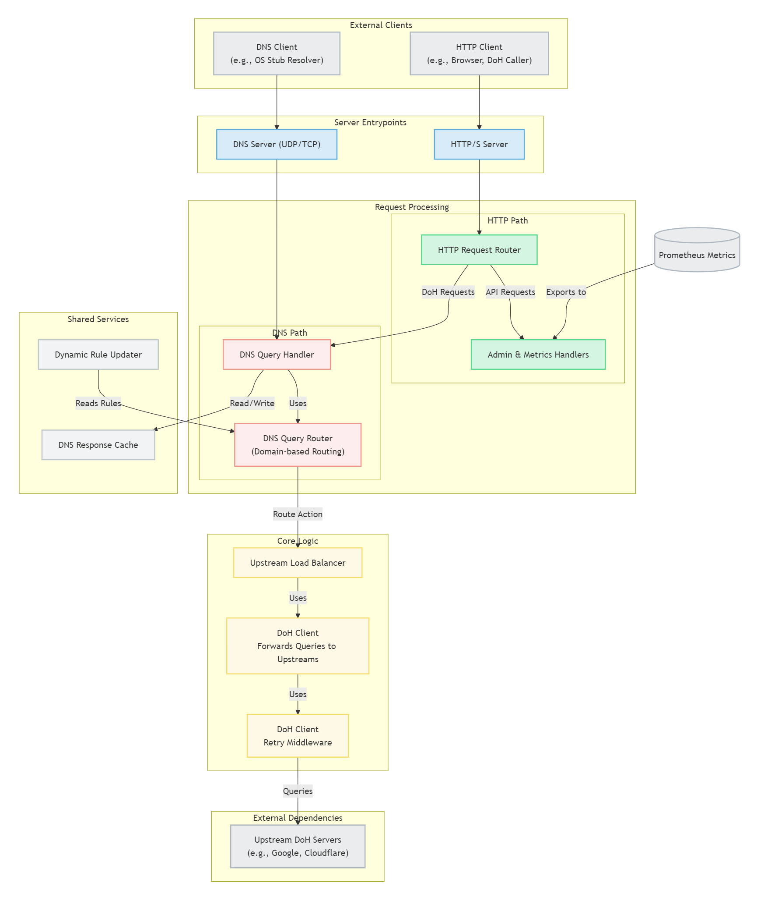

# 架构设计

Load Ants 的设计哲学是**高性能、模块化和高可扩展性**。它作为一个高效的 DNS 代理，核心任务是接收传统的 DNS 请求，并通过一系列内部处理流程，将其安全、可靠地转发到现代的 DoH (DNS-over-HTTPS) 服务器。

下图描绘了 Load Ants 的核心组件及其交互流程：

## 核心处理流程

1.  **服务监听 (DNS Service Listener)**:

    -   Load Ants 启动时会同时监听一个 UDP 端口和一个 TCP 端口（通常是 53 端口）。这是所有 DNS 请求的入口点。
    -   监听器负责接收原始的 DNS 查询数据包，并将其传递给请求处理核心。

2.  **缓存查询 (Cache Lookup)**:

    -   在进行任何外部查询之前，系统会首先在内部的高性能缓存中查找请求的域名。
    -   **如果缓存命中** (`cache hit`)，并且缓存条目尚未过期，系统将直接使用缓存的响应，跳过后续所有步骤，从而极大地提升解析速度并降低上游服务器的负载。
    -   缓存模块同时支持正向缓存（成功解析的记录）和负向缓存（不存在的域名或解析错误的记录），以避免对无效域名的重复查询。

3.  **路由引擎 (Routing Engine)**:

    -   **如果缓存未命中** (`cache miss`)，请求将被交给路由引擎。
    -   路由引擎是 Load Ants 的决策中心。它会根据 `config.yaml` 中定义的 `static_rules` 规则，对查询的域名进行匹配。
    -   匹配支持多种方式：精确域名、通配符 (`*.example.com`) 和正则表达式。
    -   根据匹配到的第一条规则，路由引擎决定下一步的操作，通常是 `forward` (转发) 或 `block` (拦截)。

4.  **上游管理 (Upstream Groups)**:

    -   如果路由决策是 `forward`，请求将被发送到规则指定的**上游组**。
    -   上游组是一系列 DoH 服务器的逻辑集合。你可以为不同的上游组配置不同的负载均衡策略（如轮询、加权轮询、随机）和认证方式（如 Bearer Token）。
    -   这种分组机制使得用户可以灵活地将不同类型的流量导向不同的 DoH 提供商（例如，国内流量走国内 DoH，国外流量走国外 DoH）。

5.  **HTTP/DoH 客户端 (HTTP/DoH Client)**:

    -   一旦选定了上游 DoH 服务器，HTTP 客户端就会介入。
    -   它负责将标准的 DNS 查询报文打包成一个符合 DoH 规范的 HTTPS 请求。这包括设置正确的 HTTP 头（如 `Content-Type: application/dns-message`）和将 DNS 查询作为 HTTP Body 发送。
    -   客户端内置了连接池，可以高效复用与上游服务器的 TCP/TLS 连接，减少握手延迟。
    -   它还根据全局配置的重试策略执行重试。如果对某个 DoH 服务器的请求失败或超时，它会根据该策略进行重试，或尝试组内的下一个服务器。

6.  **响应处理与缓存更新 (Response Handling & Cache Update)**:
    -   当 DoH 服务器返回 HTTPS 响应后，HTTP 客户端会解析出其中的 DNS 响应数据。
    -   该响应首先会被送往缓存模块进行**更新** (`cache update`)，以便下一次相同的查询可以直接命中缓存。
    -   最后，响应被打包成标准的 DNS UDP/TCP 数据包，通过最初的监听器连接返回给客户端。

模块化的架构确保了每个组件职责单一，并且流程清晰、高效。通过配置文件，用户可以对缓存、路由、上游等几乎所有环节进行精细调整，以适应各种复杂的网络环境和需求。

---

### 下一步

-   [➡️ 了解核心概念](../concepts/index.md)
-   [➡️ 查看部署方案](../deployment/index.md)
