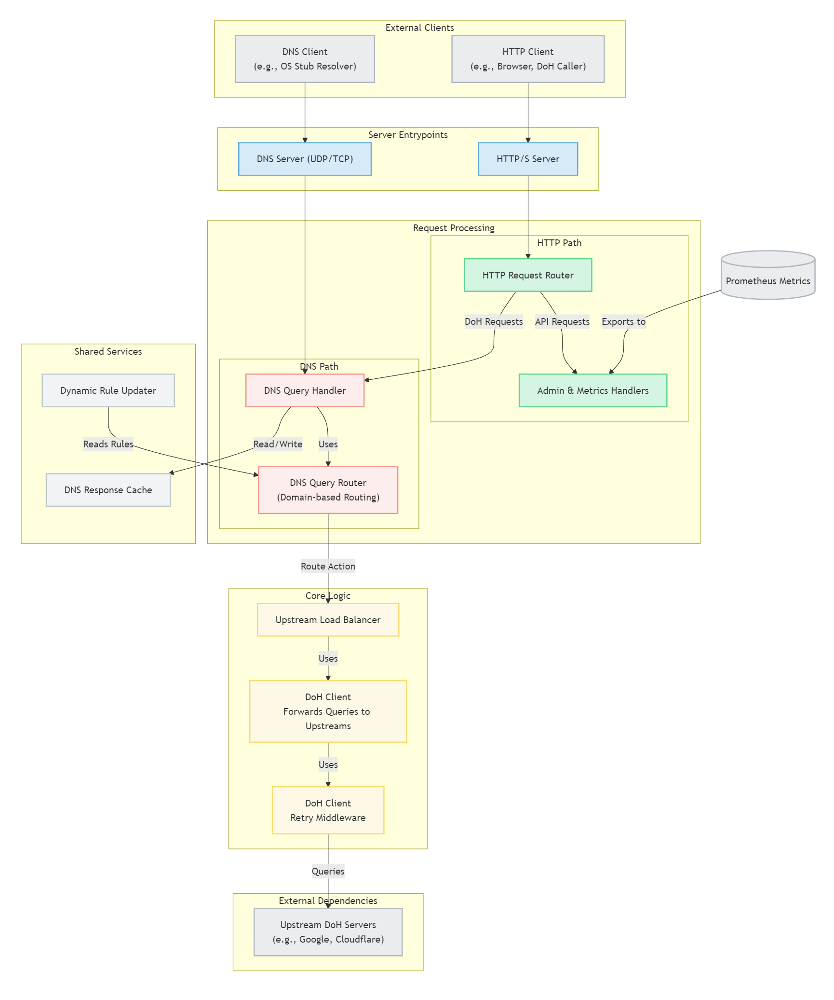

# 架构设计

Load Ants 的设计哲学是**高性能、模块化和高可扩展性**。它作为一个高效的 DNS 代理，核心任务是接收 DNS 请求，并通过一系列内部处理流程，将其安全、可靠地转发到上游解析器（DoH 或传统 DNS）。

下图描绘了 Load Ants 的核心组件及其交互流程：

## 核心处理流程

1.  **服务监听 (DNS Service Listener)**:
    - Load Ants 启动时会同时监听一个 UDP 端口和一个 TCP 端口（通常是 53 端口）。这是所有 DNS 请求的入口点。
    - 监听器负责接收原始的 DNS 查询数据包，并将其传递给请求处理核心。

2.  **缓存查询 (Cache Lookup)**:
    - 在进行任何外部查询之前，系统会首先在内部的高性能缓存中查找请求的域名。
    - **如果缓存命中** (`cache hit`)，并且缓存条目尚未过期，系统将直接使用缓存的响应，跳过后续所有步骤，从而极大地提升解析速度并降低上游服务器的负载。
    - 缓存模块同时支持正向缓存（成功解析的记录）和负向缓存（不存在的域名或解析错误的记录），以避免对无效域名的重复查询。

3.  **路由引擎 (Routing Engine)**:
    - **如果缓存未命中** (`cache miss`)，请求将被交给路由引擎。
    - 路由引擎是 Load Ants 的决策中心。它会根据 `config.yaml` 中定义的 `rules.static` 或者 `rules.remote` 规则，对查询的域名进行匹配。
    - 匹配支持多种方式：精确域名、通配符 (`*.example.com`) 和正则表达式。
    - 根据匹配到的第一条规则，路由引擎决定下一步的操作，通常是 `forward` (转发) 或 `block` (拦截)。

4.  **上游管理 (Upstream Groups)**:
    - 如果路由决策是 `forward`，请求将被发送到规则指定的**上游组**。
    - 上游组是上游服务器的逻辑集合。每个组通过 `protocol` 指定上游类型：`doh`（DoH）或 `dns`（传统 DNS，UDP/TCP）。
    - 你可以为不同的上游组配置不同的负载均衡策略（如轮询、加权轮询、随机）。对于 DoH 组，还可以配置认证与代理等能力。
    - 这种分组机制使得用户可以灵活地将不同类型的流量导向不同的上游路径（例如，外网域名走 DoH，内网域名走局域网 DNS）。

5.  **上游客户端 (Upstream Client)**:
    - **对于 DoH 上游（`protocol: doh`）**：HTTP/DoH 客户端负责把 DNS 报文封装为符合 DoH 规范的 HTTPS 请求（如 `Content-Type: application/dns-message`），并复用连接池以减少握手延迟；如配置了重试策略，将按策略执行重试。
    - **对于传统 DNS 上游（`protocol: dns`）**：DNS 客户端负责与上游的 `IP:端口` 进行 UDP/TCP 通信；默认优先 UDP，在收到 UDP 响应且 `TC=1`（截断）时会自动回退到 TCP 重试（或你可通过 `dns.prefer_tcp=true` 直接使用 TCP）。TCP 连接可复用，并可在失败后按需重连（`dns.tcp_reconnect`）。

6.  **响应处理与缓存更新 (Response Handling & Cache Update)**:
    - 当上游返回响应后，Load Ants 会得到完整的 DNS 响应报文（无论该上游是 DoH 还是传统 DNS）。
    - 该响应首先会被送往缓存模块进行**更新** (`cache update`)，以便下一次相同的查询可以直接命中缓存。
    - 最后，响应被打包成标准的 DNS UDP/TCP 数据包或者 DoH 响应，通过最初的监听器连接返回给客户端。

模块化的架构确保了每个组件职责单一，并且流程清晰、高效。通过配置文件，用户可以对缓存、路由、上游等几乎所有环节进行精细调整，以适应各种复杂的网络环境和需求。

---

### 下一步

- [➡️ 了解核心概念](../concepts/index.md)
- [➡️ 查看部署方案](../deployment/index.md)
