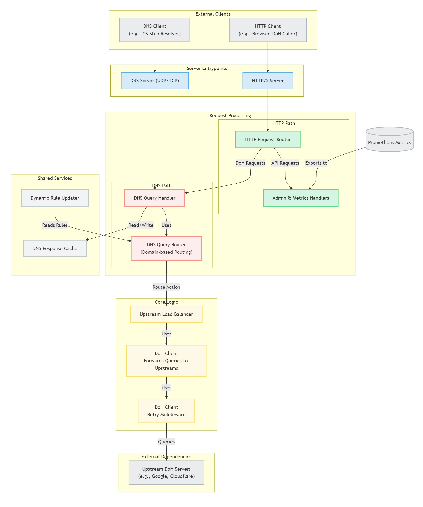

# 架构设计

Load Ants 的设计哲学是**高性能、模块化和高可扩展性**。作为高效的 DNS 代理，它的核心任务是接收 DNS 请求，经过一系列内部处理流程后，安全、可靠地转发到上游解析器：DNS-over-HTTPS（DoH）服务器或传统 DNS 服务器。

下图描绘了 Load Ants 的核心组件及其交互流程：

## 核心处理流程

1.  **服务监听（DNS Service Listener）**：
    - Load Ants 启动时会同时监听一个 UDP 端口和一个 TCP 端口（通常是 53 端口）。这是所有 DNS 请求的入口点。
    - 监听器负责接收原始的 DNS 查询数据包，并将其传递给请求处理核心。
    - Load Ants 还可以启用 HTTP(S) 监听来接收 DoH 查询：`/dns-query` 路径支持 GET 与 POST（`application/dns-message`），`/resolve` 路径提供 JSON 格式的 GET 查询；配置 `tls_cert`/`tls_key` 后监听自动启用 TLS。
    - Admin 服务器在独立端口提供健康检查、Prometheus 指标与缓存清理等运维端点。
    - 启用速率限制（`rate_limit`）后，超限请求会被直接拒绝：UDP/TCP 查询收到 `REFUSED` 响应，DoH 请求收到 HTTP 429。

2.  **缓存查询（Cache Lookup）**：
    - 在发起任何外部查询之前，系统首先在内部缓存中查找请求的域名。
    - **如果缓存命中**（`cache hit`）且缓存条目尚未过期，系统将直接使用缓存的响应，跳过后续所有步骤，从而极大地提升解析速度并降低上游服务器的负载。
    - 缓存模块同时支持正向缓存（成功解析的记录）和负向缓存（域名不存在的 `NXDOMAIN` 响应与无匹配记录的 `NODATA` 响应；`SERVFAIL` 等错误响应一律不缓存），以避免对无效域名的重复查询。
    - 对于缓存未命中的相同并发查询，请求处理核心会执行请求合并（request coalescing）：只向上游实际发起一次查询，其余并发请求共享该结果，避免重复的上游请求。

3.  **路由引擎（Routing Engine）**：
    - **如果缓存未命中**（`cache miss`），请求将交给路由引擎。
    - 路由引擎是 Load Ants 的决策中心。它根据 `config.yaml` 中定义的 `static_rules` 或 `remote_rules` 匹配查询的域名。
    - 匹配支持多种方式：精确域名、通配符（`*.example.com`）和正则表达式。
    - 路由引擎按固定契约求值：先做精确匹配（`block` 与 `forward` 合并判断，同一域名同时配置两者时 `block` 胜出），再依次求值 `block` 阶段与 `forward` 阶段；每个阶段内，优先级为 `wildcard` > `regex` > `*`。命中后，决定下一步的操作，通常是 `forward`（转发）或 `block`（拦截）。

4.  **上游管理（Upstream Groups）**：
    - 如果路由决策是 `forward`，请求将发送到规则指定的**上游组**。
    - 上游组是上游服务器的逻辑集合。每个组通过 `scheme` 指定上游类型：`doh`（DoH）或 `dns`（传统 DNS，UDP/TCP）。
    - 你可以为不同的上游组配置不同的负载均衡策略（`roundrobin` 轮询、`weighted` 加权、`random` 随机等）。对于 DoH 组，还可以配置认证与代理等能力。
    - 这种分组机制让你可以灵活地把不同类型的流量导向不同的上游路径（例如外网域名走 DoH，内网域名走局域网 DNS）。

5.  **上游客户端（Upstream Client）**：
    - **对于 DoH 上游（`scheme: doh`）**：HTTP/DoH 客户端负责把 DNS 报文封装为符合 DoH 规范的 HTTPS 请求（如 `Content-Type: application/dns-message`），并复用连接池以减少握手延迟；如配置了重试策略，则按策略重试。
    - **对于传统 DNS 上游（`scheme: dns`）**：DNS 客户端负责与上游 `IP:端口` 的 UDP/TCP 通信；默认优先 UDP，收到 UDP 响应且 `TC=1`（截断）时自动回退到 TCP 重试（你也可以通过 `dns_client.prefer_tcp=true` 直接使用 TCP）。TCP 连接可复用，并可在失败后按需重连（`dns_client.tcp_reconnect`）。

6.  **响应处理与缓存更新（Response Handling & Cache Update）**：
    - 上游返回响应后，Load Ants 会得到完整的 DNS 响应报文（无论该上游是 DoH 还是传统 DNS）。
    - 该响应首先会送往缓存模块**更新**（`cache update`），以便下一次相同的查询直接命中缓存。
    - 最后，响应被打包成标准的 DNS UDP/TCP 数据包或者 DoH 响应，通过最初的监听器连接返回给客户端。

模块化的架构确保每个组件职责单一、流程清晰。通过配置文件，你可以精细调整缓存、路由、上游等环节，适应不同的网络环境和需求。

---

## 下一步

- [➡️ 了解核心概念](../concepts/index.md)
- [➡️ 查看部署方案](../deployment/index.md)
