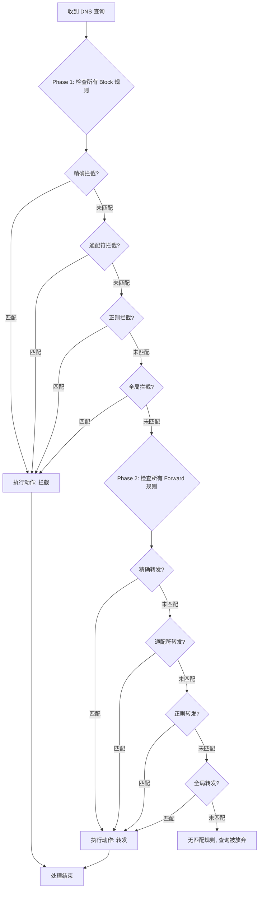

# 智能路由机制

智能路由是 Load Ants 最强大、最灵活的功能。它允许你像交通指挥官一样，根据预设的规则，精准地控制每一个 DNS 查询的去向。

### 路由的核心：拦截优先，分层匹配

Load Ants 的路由引擎遵循一个核心原则：**拦截优先 (`block` first)**。

当一个 DNS 查询进入时，Load Ants 会首先用**所有**拦截规则进行匹配。只有在没有任何拦截规则命中的情况下，它才会继续用转发规则 (`forward`) 进行匹配。

在"拦截"和"转发"这两个大的阶段内部，各自遵循着相同的匹配优先级：

1.  **精确匹配 (`exact`)**: 最高优先级。
2.  **通配符匹配 (`wildcard`)**: 次高优先级。
3.  **正则匹配 (`regex`)**: 较低优先级。
4.  **全局通配符 (`*`)**: 最低优先级。

#### 决策流程图

下面的流程图直观地展示了 Load Ants 的两阶段路由决策过程：



> ✨ **最佳实践**:
> 强烈建议在配置的最后，始终保留一条全局通配符的转发规则 (`match: "wildcard", patterns: ["*"], action: "forward", target: "..."`) 作为默认的"最终去向"，以确保所有查询都有一个明确的处理方式。

### 规则详解与场景化示例

#### 1. 精确匹配 (`exact`)

-   **用途**: 针对特定域名进行操作。
-   **示例**: 拦截一个已知的广告域名。

```yaml
static_rules:
    - match: "exact"
      patterns: ["ads.example.com"]
      action: "block"
```

在这个例子中，只有对 `ads.example.com` 的查询会被直接拦截，而对 `www.example.com` 的查询则不受影响。

#### 2. 通配符匹配 (`wildcard`)

-   **用途**: 针对某一域名下的所有子域名进行操作。
-   **示例**: 将所有公司内部域名转发到特定的上游组。

```yaml
static_rules:
    - match: "wildcard"
      patterns: ["*.my-company.internal"]
      action: "forward"
      target: "internal_dns_group"
```

在这个例子中，对 `dev.my-company.internal` 的查询都会被转发到 `internal_dns_group`。

#### 3. 正则表达式匹配 (`regex`)

-   **用途**: 进行最复杂、最灵活的域名匹配。
-   **示例**: 将所有 Google 相关服务的域名都转发到指定的"谷歌公共"上游组。

```yaml
static_rules:
  - match: "regex"
    patterns: ["^(.*\.)?google\.com$"]
    action: "forward"
    target: "google_public"
```

这个正则表达式 `^(.*\.)?google\.com$` 会匹配 `google.com` 以及它所有的子域名。

---

### 关于远程规则 (`remote_rules`)

除了在本地 `config.yaml` 中定义静态规则，Load Ants 还支持从外部 URL 加载远程规则列表。这是一种非常强大的功能，有几点需要特别说明：

-   **无缝整合**: 远程规则**不是**一种新的匹配类型。它们在被下载和解析后，会根据其内容的格式（精确域名、通配符域名等）被无缝地整合进上述的路由匹配引擎中，并严格遵循"拦截优先、分层匹配"的逻辑。一个来自远程列表的精确匹配 `block` 规则，其优先级会高于本地配置的通配符 `forward` 规则。

-   **当前支持的格式**:

    -   `type`: 目前仅支持 `url`，表示规则来源是一个 URL。
    -   `format`: 目前仅支持 `v2ray` 格式的规则列表（例如 `reject-list.txt`, `proxy-list.txt`）。

-   **未来计划**:
    > 正如项目 `README` 中所提及，未来可能会增加对更多流行规则格式（如 `clash`）的支持，以进一步增强灵活性和兼容性。

一个远程规则的配置示例如下：

```yaml
remote_rules:
    - type: "url"
      url: "https://raw.githubusercontent.com/Loyalsoldier/v2ray-rules-dat/release/reject-list.txt"
      format: "v2ray"
      action: "block"
```

这个配置会下载一个域名列表，并将列表中的所有域名作为 `block` 规则添加到路由引擎中。

---

### 下一步

-   [➡️ 学习如何配置路由规则](../configuration/routing-rules.md)
-   [➡️ 探索一些路由应用实例 (Cookbook)](../cookbook/index.md)
-   [➡️ 返回核心概念概览](./index.md)
