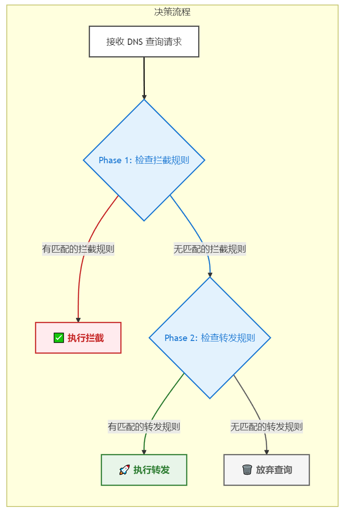

# 智能路由机制

智能路由是 Load Ants 最强大、最灵活的功能。它让你像交通指挥官一样，按预设的规则精准控制每一个 DNS 查询的去向。

### 路由的核心：固定优先级，分层匹配

Load Ants 的路由引擎按固定的优先级顺序求值规则，任何一步命中即返回：

1.  **精确匹配（`exact`）**：全局最先求值。`block` 与 `forward` 的精确规则合并为一次查找，因此同一个 pattern 同时配置了两种动作时，`block` 胜出。
2.  **`block` 动作规则**：按通配符（`wildcard`）→ 正则（`regex`）→ 全局通配符（`*`）的顺序依次求值。
3.  **`forward` 动作规则**：仅当前面的规则都未命中时，才按相同的通配符 → 正则 → 全局通配符（`*`）顺序求值。

也就是说，精确匹配优先于一切通配符/正则规则（一条精确的 `forward` 规则会胜过一条通配符的 `block` 规则）；进入通配符及更低层级后，才体现“拦截优先”——所有 `block` 规则先于所有 `forward` 规则求值。

### 当前版本的正式契约

当前版本的路由契约应理解为：

1.  精确匹配全局最先求值（`block` 与 `forward` 合并判断，同一 pattern 同时配置两种动作时 `block` 胜出）；随后先求值 `block` 阶段，再求值 `forward` 阶段。
2.  在 `block` 与 `forward` 各自阶段内，匹配顺序固定为 `wildcard > regex > *`。
3.  这是一套**固定优先级契约**，而不是“按配置文件里的声明顺序逐条命中”。
4.  在同一动作内，`exact` 规则必须在归一化后保持唯一；重复 pattern 会在启动期直接报错。同一 pattern 允许跨动作共存（同时配置 `block` 与 `forward`），命中时 `block` 优先。
5.  在同一动作内，`wildcard` 规则必须在归一化后保持唯一；重复的 `*.domain.tld` 或重复的全局 `*` 都会在启动期直接报错。
6.  `regex` 规则当前会对**同一动作内完全相同的 pattern** 做启动期冲突检查；更复杂的 regex 重叠仍不做静态分析。如果多个不同 regex 同时命中，当前实现仍按内部逆序遍历决定命中结果，因此不要假定“前定义优先”。

> 当前版本对 `remote_rules` 的保证是：**启动时加载**并并入路由引擎；之后由后台任务按 `reload_interval_secs` 间隔（默认 `3600` 秒）周期性重新加载，加载成功时原子地热替换路由引擎，失败时保留当前规则并在下一周期重试。支持 `strict/lenient` 失败策略，以及启用 `remote_rules.snapshot` 后的 last-known-good 快照恢复（快照回退同样适用于周期性加载失败的场景）。除非版本文档另有明确说明，当前版本不支持 `clash` 格式。

#### 决策流程图

下面的流程图直观地展示了 Load Ants 的分层路由决策过程：



> ✨ **最佳实践**：
> 强烈建议在配置的最后，始终保留一条全局通配符的转发规则（`match: "wildcard", patterns: ["*"], action: "forward", target: "..."`）作为默认的“最终去向”，以确保所有查询都有一个明确的处理方式。

### 规则详解与场景化示例

#### 1. 精确匹配（`exact`）

- **用途**：匹配特定域名。
- **示例**：拦截一个已知的广告域名。

```yaml
static_rules:
    - match: "exact"
      patterns: ["ads.example.com"]
      action: "block"
```

在这个例子中，只有对 `ads.example.com` 的查询会被直接拦截，而对 `www.example.com` 的查询则不受影响。

#### 2. 通配符匹配（`wildcard`）

- **用途**：匹配某一域名下的所有子域名。
- **示例**：将所有公司内部域名转发到特定的上游组。

```yaml
static_rules:
    - match: "wildcard"
      patterns: ["*.my-company.internal"]
      action: "forward"
      target: "internal_dns_group"
```

在这个例子中，对 `dev.my-company.internal` 的查询会被转发到 `internal_dns_group`。

#### 3. 正则表达式匹配（`regex`）

- **用途**：支持最复杂、最灵活的域名匹配。
- **示例**：将所有 Google 相关服务的域名都转发到指定的“谷歌公共”上游组。

```yaml
static_rules:
  - match: "regex"
    patterns: ["^(.*\.)?google\.com$"]
    action: "forward"
    target: "google_public"
```

这个正则表达式 `^(.*\.)?google\.com$` 会匹配 `google.com` 及其全部子域名。

---

### 关于远程规则（`remote_rules`）

除了在本地 `config.yaml` 中定义静态规则，Load Ants 还支持从外部 URL 加载远程规则列表。使用该功能时有几点需要注意：

- **无缝整合**：远程规则**不是**一种新的匹配类型。它们下载并解析后，会按内容格式（精确域名、通配符域名等）整合进上述路由匹配引擎，并严格遵循“固定优先级、分层匹配”的逻辑。一个来自远程列表的精确匹配 `block` 规则，其优先级会高于本地配置的通配符 `forward` 规则。

- **当前支持的格式**：
    - `type`：目前仅支持 `url`，表示规则来源是一个 URL。
    - `format`：目前仅支持 `v2ray` 格式的规则列表（例如 `reject-list.txt`、`proxy-list.txt`）。
- **当前支持的恢复能力**：
    - 快照通过 `remote_rules` 下的嵌套配置 `snapshot` 控制（`enabled` 默认为 `true`），用 `path` 指定本地快照目录。
    - 当远程源加载失败（无论发生在启动时还是周期性重新加载时），只要该 URL 对应的快照仍可读取，Load Ants 就会使用 last-known-good 快照恢复，并记录 degraded/fallback 状态。

- **未来计划**：当前版本不支持 `clash` 等更多规则格式。

一个远程规则的配置示例如下：

```yaml
remote_rules:
    - type: "url"
      url: "https://raw.githubusercontent.com/Loyalsoldier/v2ray-rules-dat/release/reject-list.txt"
      format: "v2ray"
      action: "block"
```

这个配置会下载一个域名列表，并将列表中的所有域名作为 `block` 规则添加到路由引擎中。

---

### 下一步

- [➡️ 学习如何配置路由规则](../configuration/routing-rules.md)
- [➡️ 探索一些路由应用实例（Cookbook）](../cookbook/index.md)
- [➡️ 返回核心概念概览](./index.md)
