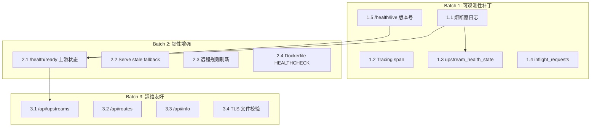
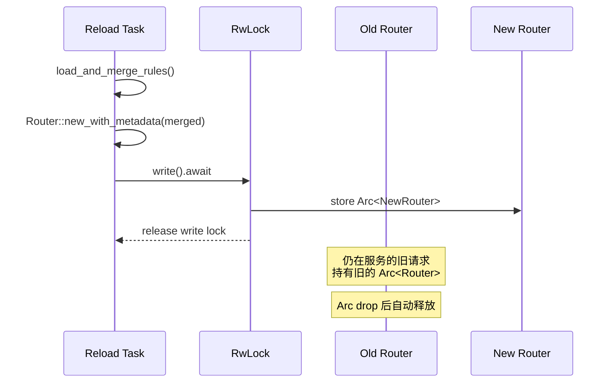

# Load-Ants DNS Forwarder 功能缺失修复规格（Spec）

> **Enabled Profiles**: solution / api / config / ops
> **Out-of-scope**: 不做 DoH 入站协议重构；不做 DNSSEC 验证；不做分布式部署方案。

---

## 1. 背景与目标

### 1.1 背景

Load-Ants 是一个 Rust 实现的 DNS 转发器，支持 DoH/DNS 上游、负载均衡熔断、规则路由和缓存。当前版本缺少生产运维所需的关键可观测性、韧性增强和运维友好功能：

- **可观测性盲区**：熔断器状态迁移无日志/无指标，DNS 请求缺乏 tracing span 关联，无法追踪单次请求的完整生命周期。
- **韧性不足**：上游故障时缓存中的过期条目（stale entry）无法作为后备返回，远程规则不支持运行时自动刷新。
- **运维不便**：`/health` 端点不反映上游健康状态，缺少调试用的 Admin API，TLS 证书缺失不会在启动时被检测到。

### 1.2 目标

| # | 目标 | 验收标准 |
|---|------|----------|
| G1 | 100% 熔断器状态迁移可观测 | 每次 H→U / U→HO / HO→H / HO→U 迁移产生 1 条 `warn!`/`info!` 日志 + 1 次 metric 递增 |
| G2 | 每个 DNS 请求可通过 tracing 日志全链路追踪 | 请求入口创建 span，所有下游日志自动关联 |
| G3 | 上游全部故障时可用 stale 缓存兜底 | `stale_while_revalidate > 0` 时，上游失败路径返回过期缓存而非 SERVFAIL |
| G4 | 远程规则支持定时热刷新 | 配置刷新间隔后，定时拉取并原子替换 Router |
| G5 | `/health/ready` 区分 ok/degraded/unhealthy | 聚合缓存 + 上游状态，返回正确 HTTP 状态码 |
| G6 | Admin API 提供运维信息 | `/api/upstreams`、`/api/routes`、`/api/info` 可被 `curl` 调用 |
| G7 | TLS 证书/密钥文件在启动时校验存在性 | 配置了 TLS 但文件不存在时，启动失败并给出明确错误 |

### 1.3 非目标

- 不引入 gRPC/OAuth 到 Admin API
- 不做分布式熔断状态同步
- 不改变现有 DNS 协议解析逻辑
- 不改变 `LoadBalancer` trait 的公共接口签名（仅扩展 `ServerHealth` 和 `ServerState` 可见性）

### 1.4 术语与缩写

| 术语 | 定义 |
|------|------|
| **H** | `ServerState::Healthy` — 上游服务器正常 |
| **U** | `ServerState::Unhealthy` — 上游服务器熔断中 |
| **HO** | `ServerState::HalfOpen` — 熔断冷却期已过，允许探测请求 |
| **Stale Entry** | 缓存中已超过 `effective_ttl` 但仍在 `stale_while_revalidate` 时间窗口内的条目 |
| **Router** | `crate::router::Router` — 持有所有路由规则的匹配引擎 |
| **AdminServer** | `crate::admin::AdminServer` — 管理端 HTTP 服务器 |

---

## 2. 范围与约束

### 2.1 系统边界

| In-Scope 模块 | 变更类型 | 说明 |
|---------------|----------|------|
| `src/balancer.rs` | 修改 | `ServerState` pub、`ServerHealth::state()` pub、状态迁移日志 + metric |
| `src/handler.rs` | 修改 | tracing span、stale fallback、inflight gauge |
| `src/metrics.rs` | 修改 | 新增 4 个 metric |
| `src/admin.rs` | 修改 + 新增 | builder 扩展、health 增强、3 个新 API |
| `src/server.rs` | 修改 | DNS 入口 tracing span |
| `src/cache.rs` | 修改 | 新增 `get_stale()` 方法 |
| `src/remote_rule/mod.rs` | 修改 | 新增 `start_reload_task()` |
| `src/config/mod.rs` | 修改 | TLS 文件存在性校验 |
| `src/main.rs` | 修改 | 传递版本信息和共享状态 |
| `Dockerfile` / `Dockerfile-arm64` | 修改 | 添加 HEALTHCHECK |

### 2.2 约束清单

| # | 约束 | 来源 |
|---|------|------|
| C1 | 所有新增 Prometheus 指标必须使用 `loadants_` 前缀，与现有命名风格一致 | 现有 `metrics.rs` |
| C2 | Admin API 路由必须遵循现有 `/api/` 前缀风格 | 现有 `/api/cache/clear` |
| C3 | `LoadBalancer` trait 的现有方法签名（`servers()`, `health_states()`, `select_server()` 等）禁止变更 | 多实现者依赖 |
| C4 | `RequestHandler` 的变更必须保持线程安全（`Send + Sync`），因其通过 `Arc` 跨 task 共享 | 架构约束 |
| C5 | 远程规则刷新必须原子替换 Router（旧 Router 继续服务直到新 Router 就绪） | 零停机要求 |
| C6 | 熔断器日志不得引入锁竞争（必须保持无锁原子操作路径） | 性能约束 |

---

## 3. 需求

### 3.1 功能需求（FR）

| ID | 需求 | Batch | 优先级 |
|----|------|-------|--------|
| FR-1.1 | 熔断器状态迁移时输出结构化日志 | B1 | P0 |
| FR-1.2 | DNS 请求入口创建 tracing span | B1 | P0 |
| FR-1.3 | 新增 `upstream_health_state` gauge 指标 | B1 | P0 |
| FR-1.4 | 新增 `inflight_requests` gauge 指标 | B1 | P1 |
| FR-1.5 | `/health/live` 返回存活状态与版本号 | B1 | P1 |
| FR-2.1 | `/health/ready` 返回上游组健康聚合状态 | B2 | P0 |
| FR-2.2 | 上游失败路径使用 stale 缓存后备 | B2 | P0 |
| FR-2.3 | 远程规则定时刷新 | B2 | P1 |
| FR-2.4 | Dockerfile HEALTHCHECK | B2 | P2 |
| FR-3.1 | Admin API `/api/upstreams` | B3 | P1 |
| FR-3.2 | Admin API `/api/routes` | B3 | P1 |
| FR-3.3 | Admin API `/api/info` | B3 | P2 |
| FR-3.4 | TLS 证书文件存在性启动校验 | B3 | P0 |

### 3.2 非功能需求（NFR）

| ID | 类型 | 需求 |
|----|------|------|
| NFR-1 | 性能 | 新增日志/指标不得在高并发路径引入锁竞争或内存分配（原子操作 + pre-allocated metric） |
| NFR-2 | 安全 | Admin API 新端点受现有 `auth_middleware` 保护 |
| NFR-3 | 可观测性 | 所有新增 metric 可在 `/metrics` 端点导出 |
| NFR-4 | 兼容性 | `/health/ready` 以 `cacheInfo` 字段返回缓存信息，结构为 `{enabled, entries}`（缓存未配置时返回 `{enabled: false}`） |

---

## 4. 方案概述

### 4.1 高层架构

本规格以 **3 个 Batch** 交付，Batch 之间存在明确的依赖关系：



### 4.2 跨 Batch 前置依赖（Infrastructure Prerequisites）

以下变更影响多个 Batch，必须在 B1 最先实施：

| 变更 | 影响范围 | 说明 |
|------|----------|------|
| `ServerState` 可见性 `pub` | B1.1, B1.3, B2.1, B3.1 | 当前为 `enum ServerState`（crate-private），需改为 `pub enum ServerState` |
| `ServerHealth::state()` 可见性 `pub` | B1.1, B1.3, B2.1, B3.1 | 当前为 `fn state()`（private），需改为 `pub fn state()` |
| `AdminServer` builder 扩展 | B2.1, B3.1, B3.2, B3.3 | 需新增 `with_upstream_state()`, `with_startup_info()`, `with_router_state()` |
| `RequestHandler.router` 类型变更 | B2.3 | `Arc<Router>` → `Arc<RwLock<Arc<Router>>>` |

---

## 5. 详细设计

### 5.1 Batch 1 — 可观测性补丁

#### 5.1.1 FR-1.1：熔断器状态迁移日志

**变更文件**: `src/balancer.rs`

**前置条件**:
1. `ServerState` 改为 `pub enum ServerState`，并为每个变体派生 `Clone + Copy`（已有但未 pub）
2. `ServerHealth::state()` 改为 `pub fn state()`
3. `ServerState` 实现 `Display` trait 或提供 `as_str()` 方法用于日志格式化

**行为规格**:

在 `record_failure()` 和 `record_success()` 内部，**先计算迁移前状态**，再执行原有的原子操作，最后**比较迁移后状态**。仅当 `old_state != new_state` 时输出日志。

| 迁移方向 | 触发方法 | 日志级别 | 日志字段 |
|----------|----------|----------|----------|
| H → U | `record_failure()` | `warn!` | `server_index`, `state_from="healthy"`, `state_to="unhealthy"`, `failure_count` |
| U → HO | `record_success()` 不触发此迁移。HO 由 `state()` 基于时间自动计算 | — | — |
| HO → U | `record_failure()` | `warn!` | `server_index`, `state_from="half_open"`, `state_to="unhealthy"`, `failure_count` |
| HO → H | `record_success()` | `info!` | `server_index`, `state_from="half_open"`, `state_to="healthy"` |

**实现约束**:

```
伪代码逻辑（record_failure）:
  1. old_state = self.state()          // 迁移前状态快照
  2. [原有的 fetch_update 递增 failure_count]
  3. [原有的 store last_failure_time]
  4. [原有的 store half_open_probing=false]
  5. new_state = self.state()          // 迁移后状态快照
  6. if old_state != new_state:
       tracing::warn!(server_index, state_from, state_to, failure_count, "Circuit breaker state transition")
       METRICS.circuit_breaker_transitions_total.with_label_values(&[state_from_str, state_to_str]).inc()
```

```
伪代码逻辑（record_success）:
  1. old_state = self.state()
  2. [原有的 store failure_count=0]
  3. [原有的 store half_open_probing=false]
  4. new_state = self.state()
  5. if old_state != new_state:
       tracing::info!(...)
       METRICS.circuit_breaker_transitions_total...inc()
```

**注意**: U → HO 的迁移不在 `record_*` 方法内发生，而是由 `state()` 根据时间差自动计算。因此 gauge 指标的 U→HO 转换需要通过定时刷新或在 `state()` 被调用时隐式触发。规格选择后者：**每次 `state()` 返回 `HalfOpen` 且上次记录状态不是 `HalfOpen` 时，记录迁移**（见 5.1.3）。

**新增 Metric**:

| 名称 | 类型 | 标签 | 描述 |
|------|------|------|------|
| `loadants_circuit_breaker_transitions_total` | `IntCounterVec` | `state_from`, `state_to` | 熔断器状态迁移次数 |

标签值域：`healthy`, `unhealthy`, `half_open`

---

#### 5.1.2 FR-1.2：DNS 请求 Tracing Span

**变更文件**: `src/server.rs`（`HandlerAdapter::handle_request`）、`src/handler.rs`（`RequestHandler::handle_request`）

**行为规格**:

1. 在 `server.rs` 的 `HandlerAdapter::handle_request()` 中（解析到查询名称后），创建 span：

```
let span = tracing::info_span!("dns_query",
    query = %query_name_string,    // 如 "example.com."
    qtype = %query_type_label,     // 如 "A"
    protocol = %protocol,          // "udp" | "tcp"
    client = %request.src().ip()
);
```

2. 使用 `span.enter()` 包裹后续的 `self.handler.handle_request(&message)` 调用：

```
let _guard = span.enter();
match self.handler.handle_request(&message).await {
    // ...
}
```

**注意**: 由于 `handle_request` 是 `async fn`，直接使用 `span.enter()` 会在 `.await` 点产生问题。必须使用 `tracing::Instrument::instrument()` 替代：

```
self.handler.handle_request(&message).instrument(span).await
```

3. `handler.rs` 的 `RequestHandler::handle_request()` 内部**不再额外创建 span**。所有现有的 `debug!`, `info!`, `warn!`, `error!` 宏自动继承外层 span 上下文。

**注意**: `query_name_string` 需要在 span 创建前从 `parse_request_message` 的结果中提取。如果 `parse_request_message` 失败，使用 `"unknown"` 作为 query 字段值。

---

#### 5.1.3 FR-1.3：`upstream_health_state` Gauge

**变更文件**: `src/metrics.rs`、`src/balancer.rs`

**新增 Metric**:

| 名称 | 类型 | 标签 | 描述 |
|------|------|------|------|
| `loadants_upstream_health_state` | `IntGaugeVec` | `group`, `server` | 上游服务器健康状态值 |

**值语义**:

| 值 | 含义 | 对应 `ServerState` |
|----|------|--------------------|
| 0 | `Unhealthy` | `ServerState::Unhealthy` |
| 1 | `HalfOpen` | `ServerState::HalfOpen` |
| 2 | `Healthy` | `ServerState::Healthy` |

**更新机制**:

在 `record_failure()` 和 `record_success()` 中发生状态迁移时，执行：
```
METRICS.upstream_health_state
    .with_label_values(&[group_name, server_addr])
    .set(new_state_value);
```

**关键设计**: `ServerHealth` 当前不持有 group/server 信息。需要扩展 `ServerHealth` 或传递标签：

**方案选择**: 为 `ServerHealth` 添加两个字段 `group_label: String` 和 `server_label: String`，在 `ServerHealth::new()` 时初始化。`LoadBalancer` 实现中创建 `ServerHealth` 时传入 server 标识信息。

| 方案 | 复杂度 | 性能影响 | 选择 |
|------|--------|----------|------|
| A: ServerHealth 持有 label | 低（构造时 one-time 分配） | 零运行时开销 | ✓ 推荐 |
| B: metric 更新由外层 LoadBalancer 做 | 中（需改 trait 方法） | 相同 | ✗ 侵入性大 |

**group_name 传递路径**: `UpstreamManager::new()` 已知 group name，创建 `LoadBalancer` 时传入。需在 `RoundRobinBalancer::new()` / `WeightedBalancer::new()` / `RandomBalancer::new()` 中传递 group name。

**server_label 规则**: DoH 服务器使用 URL host（如 `dns.google`），DNS 服务器使用 `ip:port`。

---

#### 5.1.4 FR-1.4：`inflight_requests` Gauge

**变更文件**: `src/metrics.rs`、`src/handler.rs`

**新增 Metric**:

| 名称 | 类型 | 标签 | 描述 |
|------|------|------|------|
| `loadants_inflight_requests` | `IntGauge` | 无 | 当前正在处理的 DNS 请求数 |

**行为规格**:

在 `server.rs` 的 `HandlerAdapter::handle_request()` 入口处（span 创建之前）：
```
METRICS.inflight_requests.inc();
```

在 `handle_request()` 返回之前（所有分支出口处）：
```
METRICS.inflight_requests.dec();
```

**实现建议**: 使用 RAII guard 确保每条退出路径都触发 `dec()`：

```
struct InflightGuard;
impl InflightGuard {
    fn new() -> Self { METRICS.inflight_requests.inc(); Self }
}
impl Drop for InflightGuard {
    fn drop(&mut self) { METRICS.inflight_requests.dec(); }
}
```

---

#### 5.1.5 FR-1.5：`/health/live` 存活检查与版本号

**变更文件**: `src/admin.rs`、`src/main.rs`

**AdminServer 变更**:

新增字段：
```rust
pub struct AdminServer {
    // ... 现有字段
    version: Option<String>,   // 新增
}
```

新增 builder 方法：
```rust
pub fn with_version(mut self, version: String) -> Self {
    self.version = Some(version);
    self
}
```

**存活端点契约**:

Admin 服务器注册 `GET /health/live` 路由（不受 `auth_middleware` 保护），处理器 `health_live_handler` 需要从 `State` 中获取 version。当前 `State` 类型是 `Option<Arc<DnsCache>>`，需要扩展为包含 version 的结构体。

**方案选择**:

引入 `AdminState` 结构体替代当前的 `Option<Arc<DnsCache>>` 作为 axum State：

```rust
#[derive(Clone)]
pub struct AdminState {
    pub cache: Option<Arc<DnsCache>>,
    pub version: Option<String>,
    pub upstream_state: Option<Arc<UpstreamManager>>,  // B2 使用
    pub router_state: Option<Arc<RwLock<Arc<Router>>>>, // B3 使用
    pub startup_info: Option<StartupInfo>,              // B3 使用
}
```

B1 阶段仅填充 `cache` 和 `version`，其余字段在后续 Batch 中填充。

**返回 JSON**:
```json
{
    "status": "ok",
    "version": "0.3.1"
}
```

**main.rs 调用**:
```rust
let admin_server = AdminServer::new(admin_listen_addr)
    .with_cache(Arc::clone(&cache))
    .with_auth(admin_auth)
    .with_version(env!("CARGO_PKG_VERSION").to_string());
```

---

### 5.2 Batch 2 — 韧性增强

#### 5.2.1 FR-2.1：`/health/ready` 报告上游状态

**变更文件**: `src/admin.rs`、`src/upstream/manager.rs`、`src/main.rs`

**前置条件**: `AdminState` 已引入（B1.5），`upstream_state` 字段可用。

**UpstreamManager 新增方法**:

```rust
impl UpstreamManager {
    /// 返回所有 upstream group 的健康状态摘要
    pub fn health_summary(&self) -> Vec<GroupHealthSummary> {
        self.groups.iter().map(|(name, state)| {
            let servers = state.lb.servers();
            let health_states = state.lb.health_states();
            let healthy_count = health_states.iter()
                .filter(|h| matches!(h.state(), ServerState::Healthy))
                .count();
            GroupHealthSummary {
                name: name.clone(),
                servers: servers.len(),
                healthy: healthy_count,
                unhealthy: servers.len() - healthy_count,
            }
        }).collect()
    }
}

pub struct GroupHealthSummary {
    pub name: String,
    pub servers: usize,
    pub healthy: usize,
    pub unhealthy: usize,
}
```

**就绪端点契约**:

Admin 服务器注册 `GET /health/ready` 路由（不受 `auth_middleware` 保护），处理器 `health_ready_handler` 返回就绪状态与上游聚合信息。

**health_ready_handler 返回结构**:

```json
{
    "status": "ok|degraded|unhealthy",
    "version": "0.3.1",
    "cacheInfo": { "enabled": true, "entries": 123 },
    "upstreams": {
        "google": { "servers": 2, "healthy": 2, "unhealthy": 0, "halfOpen": 0, "status": "ok" },
        "public": { "servers": 4, "healthy": 3, "unhealthy": 1, "halfOpen": 0, "status": "degraded" }
    }
}
```

**状态判定逻辑**:

```
status 计算:
  1. 若 upstream_state 为 None（未配置上游）→ status = "ok"
  2. 遍历所有 group:
     a. 若任何 group 的 healthy == 0（全部 unhealthy 且 servers > 0）
        → status = "unhealthy"，立即返回
     b. 若任何 group 的 unhealthy > 0
        → 标记 degraded = true
  3. degraded == true → status = "degraded"
  4. 否则 → status = "ok"

HTTP 状态码:
  "ok"       → 200
  "degraded" → 200
  "unhealthy" → 503
```

**JSON 序列化注意**: `upstreams` 字段只在 `upstream_state` 存在时包含。如果未配置上游（如仅做 block 规则的部署），`upstreams` 字段省略。

---

#### 5.2.2 FR-2.2：Serve Stale on Upstream Failure

**变更文件**: `src/cache.rs`、`src/handler.rs`、`src/metrics.rs`

**DnsCache 新增方法**:

```rust
impl DnsCache {
    /// 获取已过期但仍在 stale 窗口内的缓存条目。
    /// 仅当 stale_while_revalidate > 0 且条目处于 [effective_ttl, effective_ttl + stale_while_revalidate] 区间时返回。
    /// 返回的响应 TTL 设为 1（避免客户端过度缓存过期数据）。
    pub async fn get_stale(&self, query: &Message) -> Option<Message> {
        // 仅在 stale_while_revalidate > 0 时有效
        if self.stale_while_revalidate == 0 {
            return None;
        }
        let key = CacheKey::from_message(query)?;
        let entry = self.cache.get(&key).await?;
        let elapsed = entry.timestamp.elapsed().as_secs();
        // 已过 effective_ttl 但仍在 stale 窗口
        if elapsed >= entry.effective_ttl as u64
            && elapsed < entry.effective_ttl as u64 + self.stale_while_revalidate
        {
            let mut response = entry.message.as_ref().clone();
            response.set_id(query.id());
            // 所有记录 TTL 设为 1
            for r in response.answers_mut() { r.set_ttl(1); }
            for r in response.name_servers_mut() { r.set_ttl(1); }
            for r in response.additionals_mut() {
                if r.record_type() != RecordType::OPT { r.set_ttl(1); }
            }
            Some(response)
        } else {
            None
        }
    }
}
```

**handler.rs 变更**（`handle_forward` 方法）:

```
伪代码:
  1. result = self.upstream.forward(request, target_group).await
  2. match result:
       Ok(response) => Ok(response)
       Err(e) =>
         a. 检查 self.cache 是否启用且 stale_while_revalidate > 0
         b. 若是，调用 self.cache.get_stale(request).await
         c. 若返回 Some(stale_response):
              - METRICS.stale_fallback_total.with_label_values(&[target_group]).inc()
              - warn!("Served stale cache as fallback for {query_name} after upstream failure: {e}")
              - 返回 stale_response
         d. 若返回 None 或 cache 未启用:
              - [原有逻辑] 返回 SERVFAIL
```

**新增 Metric**:

| 名称 | 类型 | 标签 | 描述 |
|------|------|------|------|
| `loadants_stale_fallback_total` | `IntCounterVec` | `group` | 因上游失败而使用过期缓存兜底的请求总数 |

**注意**: moka 的 `get()` 方法会自动延长条目生命周期（TTL 重置），因此 `get_stale` 必须使用 `moka` 的 **`get_if`** 或直接使用底层 API 避免触发 TTL 刷新。如果 moka 不支持无副作用的 get，则需要在 `get_stale` 中**不**调用 `self.cache.get()` 而改用遍历或直接访问内部状态。

**实际可行方案**: moka `Cache` 的 `get()` 会触发 `expire_after_read` 回调。当前实现的 `expire_after_read` 返回 `duration_until_expiry` 不变，因此 `get()` 不会重置 TTL，可安全使用。

---

#### 5.2.3 FR-2.3：远程规则定时刷新

**变更文件**: `src/remote_rule/mod.rs`、`src/handler.rs`、`src/bootstrap.rs`、`src/main.rs`

**Handler Router 类型变更**:

```rust
// Before
pub struct RequestHandler {
    router: Arc<Router>,
    // ...
}

// After
pub struct RequestHandler {
    router: Arc<tokio::sync::RwLock<Arc<Router>>>,
    // ...
}
```

**RequestHandler 方法变更**:

```rust
impl RequestHandler {
    pub fn new(cache: Arc<DnsCache>, router: Arc<RwLock<Arc<Router>>>, upstream: Arc<UpstreamManager>) -> Self { ... }

    // find_route_match 变更:
    async fn find_route_match(&self, query_name: &Name) -> Result<RouteMatch, AppError> {
        let router = self.router.read().await;  // 获取读锁
        let route_match = router.find_match(query_name)?;
        // route_match 是 Clone 的数据，释放锁后使用
        Ok(route_match)
    }

    // spawn_background_refresh 变更:
    // router.clone() 变为 self.router.clone()，获取读锁后调用 find_match
}
```

**新增函数**（`src/remote_rule/mod.rs`）:

```rust
/// 启动远程规则定时刷新任务。
///
/// 刷新逻辑:
/// 1. 调用 load_and_merge_rules() 拉取远程规则并合并静态规则
/// 2. 用结果构建新 Router
/// 3. 验证新 Router（validate_rule_conflicts）
/// 4. 原子替换: router_state.write().await 写入新 Arc<Router>
/// 5. 更新 route_rules_count metric
///
/// 失败时:
/// - 保留旧 Router 不变
/// - 输出 error! 日志
/// - 不 panic

async fn run_reload_task(
    remote_rules_config: RemoteRulesConfig,
    static_rules: Vec<RouteRuleConfig>,
    http_client_config: HttpClientConfig,
    router: Arc<RwLock<Arc<RoutingEngine>>>,
    statuses: Arc<RwLock<Vec<RemoteSourceStatus>>>,
)
```

**配置类型** (`src/config/rule.rs`):

```rust
pub struct RemoteRulesConfig {
    pub reload_interval_secs: u64,  // 刷新间隔（秒），默认 3600
    pub snapshot: RemoteRuleSnapshotConfig,
    pub sources: Vec<RemoteRuleConfig>,
}
```

支持两种 YAML 格式（通过自定义 Deserialize + `#[serde(untagged)]` 实现向后兼容）:

```yaml
# 新格式（推荐）
remote_rules:
  reload_interval_secs: 3600
  snapshot: { enabled: true }
  sources:
    - url: "https://..."
      format: "v2ray"
      action: "block"

# 旧格式（兼容）
remote_rules:
  - url: "https://..."
    format: "v2ray"
    action: "block"
```

**定时机制**:

```
tokio::spawn(async move {
    let mut ticker = interval(Duration::from_secs(remote_rules_config.reload_interval_secs));
    ticker.tick().await; // 跳过首次立即触发
    loop {
        ticker.tick().await;
        // load_and_merge_rules() → 成功: rebuild router + write swap
        //                         → 失败: warn + 标记 statuses 为 failed, 保留旧 router
    }
});
```

**Router 原子替换时序**:



**注意**: 读锁（`router.read().await`）获取的是 `Arc<Router>` 的克隆引用，`find_match` 在旧 Router 上执行。写锁仅在替换瞬间使用，持续时间约 1μs。

---

#### 5.2.4 FR-2.4：Dockerfile HEALTHCHECK

**变更文件**: `Dockerfile`、`Dockerfile-arm64`

**行为规格**:

```dockerfile
HEALTHCHECK --interval=30s --timeout=3s --retries=3 \
    CMD wget -qO- http://localhost:9000/health/live || exit 1
```

**探测目标**: 存活端点 `/health/live`（不使用就绪端点 `/health/ready`，避免上游故障导致容器被反复重启）。

**选择 `wget` 而非 `curl` 的理由**: Alpine Linux 默认未安装 `curl`，但包含 `busybox wget`（`-qO-` 为 busybox wget 支持的静默输出参数）。

**端口**: 使用 AdminServer 默认监听端口 `9000`（与 `server_defaults::DEFAULT_ADMIN_LISTEN` 一致）。

---

### 5.3 Batch 3 — 运维友好

#### 5.3.1 FR-3.1：Admin API `/api/upstreams`

**变更文件**: `src/admin.rs`、`src/upstream/manager.rs`

**端点**: `GET /api/upstreams`

**认证**: 受 `auth_middleware` 保护（与 `/api/cache/clear` 同级）

**UpstreamManager 新增方法**:

```rust
impl UpstreamManager {
    /// 返回所有 upstream group 的详细状态，含每个 server 的健康信息
    pub fn detailed_status(&self) -> Vec<GroupDetailedStatus>
}

pub struct GroupDetailedStatus {
    pub name: String,
    pub scheme: String,           // "doh" | "dns"
    pub strategy: String,         // "roundrobin" | "weighted" | "random"
    pub servers: Vec<ServerStatus>,
}

pub struct ServerStatus {
    pub addr: String,             // DoH: URL host, DNS: ip:port
    pub health_state: String,     // "healthy" | "unhealthy" | "half_open"
    pub failure_count: u32,
}
```

**ServerHealth 新增方法**:

```rust
impl ServerHealth {
    /// 返回当前失败计数（只读访问，不修改状态）
    pub fn failure_count(&self) -> u32 {
        self.failure_count.load(Ordering::Acquire)
    }
}
```

**响应示例**:

```json
[
    {
        "name": "google",
        "scheme": "doh",
        "strategy": "roundrobin",
        "servers": [
            { "addr": "dns.google", "health_state": "healthy", "failure_count": 0 },
            { "addr": "cloudflare-dns.com", "health_state": "unhealthy", "failure_count": 5 }
        ]
    }
]
```

**错误场景**:

| 场景 | HTTP 状态码 | 响应体 |
|------|-------------|--------|
| 未配置 upstream | 200 | `[]`（空数组） |
| 认证失败 | 401 | `{"status":"error","message":"Unauthorized"}` |

---

#### 5.3.2 FR-3.2：Admin API `/api/routes`

**变更文件**: `src/admin.rs`

**端点**: `GET /api/routes`

**认证**: 受 `auth_middleware` 保护

**前置条件**: `AdminState` 包含 `router_state: Option<Arc<RwLock<Arc<Router>>>>`

**Router 新增方法**:

```rust
impl RoutingEngine {
    /// 返回路由器中所有规则条目总数
    pub fn rule_count(&self) -> usize
}
```

**AdminState 扩展字段**:

```rust
pub struct RemoteSourceStatus {
    pub url: String,
    pub status: String,         // "ok" | "failed" | "pending"
    pub last_updated: u64,      // unix timestamp seconds
    pub rule_count: usize,
    pub error_message: Option<String>,
}
```

`AdminState` 持有 `remote_source_statuses: Option<Arc<RwLock<Vec<RemoteSourceStatus>>>>`，由 `reload_task` 写入。

**响应示例**:

```json
{
    "totalRuleCount": 1524,
    "remoteSources": [
        {
            "url": "https://example.com/blocklist.txt",
            "status": "ok",
            "lastUpdated": 1720518600,
            "ruleCount": 1200
        },
        {
            "url": "https://example.com/proxylist.txt",
            "status": "failed",
            "lastUpdated": 1720518600,
            "ruleCount": 0,
            "errorMessage": "HTTP 503"
        }
    ]
}
```

---

#### 5.3.3 FR-3.3：Admin API `/api/info`

**变更文件**: `src/admin.rs`

**端点**: `GET /api/info`

**认证**: 受 `auth_middleware` 保护

**前置条件**: `AdminState` 持有 `version: &'static str`、`startup_time: Instant` 及 `config_summary: Option<ConfigSummary>`

```rust
pub struct ConfigSummary {
    pub listen_udp: String,
    pub listen_tcp: String,
    pub listen_http: Option<String>,
    pub cache_enabled: bool,
    pub cache_max_size: usize,
    pub upstream_group_count: usize,
    pub remote_source_count: usize,
}
```

**响应示例**:

```json
{
    "version": "0.3.1",
    "uptimeSeconds": 3600,
    "configSummary": {
        "listenUdp": "0.0.0.0:53",
        "listenTcp": "0.0.0.0:53",
        "listenHttp": "0.0.0.0:8080",
        "upstreamGroupCount": 2,
        "cacheEnabled": true,
        "cacheMaxSize": 10000
    }
}
```

**脱敏规则**: `ConfigSummary` 不包含 auth token、TLS 路径内容、proxy URL 中的凭据。仅暴露结构摘要。

---

#### 5.3.4 FR-3.4：TLS 文件存在性校验

**变更文件**: `src/config/mod.rs`

**前置条件**: `validate_runtime_requirements()` 已被 `main.rs` 在启动时调用。

**行为规格**:

在 `validate_runtime_requirements()` 末尾新增检查：

```
if config.server.tls_cert 为 Some(path) 且 path 非空:
    if std::fs::metadata(path) 返回 Err(e):
        返回 ConfigError::ValidationError(
            "TLS certificate file not found: {path}: {e}"
        )

if config.server.tls_key 为 Some(path) 且 path 非空:
    if std::fs::metadata(path) 返回 Err(e):
        返回 ConfigError::ValidationError(
            "TLS private key file not found: {path}: {e}"
        )
```

**注意**: 只检查文件是否存在（`metadata` 成功），不检查文件内容是否有效（避免读取大文件的开销和权限问题）。

---

### 5.4 新增配置项

| Key | 类型 | 默认值 | 必填 | 作用 | 约束 |
|-----|------|--------|------|------|------|
| `remote_rule_reload_interval` | `u64`（秒） | `3600` | 否 | 远程规则自动刷新间隔 | 最小 60，最大 86400 |

**配置位置**: 新增字段到 `Config` 结构体或在 `RemoteRuleSnapshotConfig` 中扩展。推荐在 `Config` 顶层新增 `remote_rule_reload_interval: Option<u64>`。

---

### 5.5 新增 Metric 清单

| 名称 | 类型 | 标签 | Batch | FR |
|------|------|------|-------|----|
| `loadants_circuit_breaker_transitions_total` | `IntCounterVec` | `state_from`, `state_to` | B1 | 1.1 |
| `loadants_upstream_health_state` | `IntGaugeVec` | `group`, `server` | B1 | 1.3 |
| `loadants_inflight_requests` | `IntGauge` | — | B1 | 1.4 |
| `loadants_stale_fallback_total` | `IntCounterVec` | `group` | B2 | 2.2 |

---

### 5.6 新增 API 端点清单

| 端点 | 方法 | 认证 | Batch | FR |
|------|------|------|-------|----|
| `/api/upstreams` | GET | Bearer Token | B3 | 3.1 |
| `/api/routes` | GET | Bearer Token | B3 | 3.2 |
| `/api/info` | GET | Bearer Token | B3 | 3.3 |

所有新端点注册到 `protected_routes` Router 中，与现有 `/api/cache/clear` 路由同级。

---

## 6. 验收标准

| 条目 | 验收方法 | 通过标准 |
|------|----------|----------|
| AC-1.1 | 单元测试: 创建 `RoundRobinBalancer`，调用 `report_failure` N 次 | 状态迁移日志出现且 `circuit_breaker_transitions_total` 递增 |
| AC-1.2 | 发起 DNS 查询，检查 JSON 日志 | 日志中包含 `dns_query` span 且关联 `query`/`qtype` 字段 |
| AC-1.3 | 检查 `/metrics` 端点 | `loadants_upstream_health_state{group="xxx",server="yyy"}` 存在且值为 0/1/2 |
| AC-1.4 | 并发发送 100 个请求，检查 `/metrics` | `loadants_inflight_requests` 峰值 > 0 且最终回到 0 |
| AC-1.5 | `curl http://localhost:9000/health/live` | 响应包含 `"status": "ok"` 与 `"version": "x.y.z"` |
| AC-2.1 | 将所有上游服务器断网，`curl /health/ready` | 响应 `status: "unhealthy"` 且 HTTP 503 |
| AC-2.2 | 断网后查询已缓存域名 | 收到 TTL=1 的过期缓存响应，`stale_fallback_total` 递增 |
| AC-2.3 | 修改远程规则 URL 内容，等待刷新间隔 | 新规则生效，旧请求不受影响 |
| AC-2.4 | `docker inspect <container>` | 包含 `Healthcheck` 配置 |
| AC-3.1 | `curl http://localhost:9000/api/upstreams` | 返回 JSON 数组，含每个 group 的 server 详情 |
| AC-3.2 | `curl http://localhost:9000/api/routes` | 返回规则摘要，包含 static + remote 计数 |
| AC-3.3 | `curl http://localhost:9000/api/info` | 返回版本、启动时间、配置摘要 |
| AC-3.4 | 配置 TLS 但文件不存在，启动 | 进程退出码非 0，stderr 包含 "TLS certificate file not found" |

---

## 7. 风险与缓解

| 风险 | 触发条件 | 影响 | 缓解措施 | 监控指标 |
|------|----------|------|----------|----------|
| R1: RwLock 争用 | 规则刷新期间大量查询阻塞 | 延迟毛刺 | `RwLock::read` 是非阻塞的（多个读者并发），仅写锁阻塞。替换操作 < 1μs | `loadants_inflight_requests` |
| R2: stale fallback 返回脏数据 | 上游长时间故障，stale 窗口内数据过时 | 用户收到过期 DNS 记录 | stale TTL 设为 1 秒，强制客户端快速重试 | `loadants_stale_fallback_total` |
| R3: 熔断日志风暴 | 大量 server 同时失败 | 日志量激增 | 日志级别为 `warn!`，可通过 tracing filter 控制 | `circuit_breaker_transitions_total` 速率 |
| R4: moka cache consistency | `get_stale` 与正常 `get` 路径竞争 | 同一条目被两个路径消费 | `get_stale` 仅在 upstream 失败后调用，与正常路径互斥 | — |
| R5: reload task panic | 远程规则拉取/解析时未捕获 panic | 主进程崩溃 | `start_reload_task` 使用 `tokio::spawn` + `catch_unwind`；刷新失败仅丢弃新 Router，不影响运行 | 日志 error rate |

---

## 8. 发布与回滚

### 8.1 发布步骤

```
Batch 1 → Batch 2 → Batch 3（顺序发布，每个 Batch 独立可验证）
```

1. **Batch 1**: 纯增量变更（新日志 + 新指标），回滚 = 移除代码，不影响现有功能
2. **Batch 2**: 涉及 `RequestHandler.router` 类型变更，需确保所有调用方适配
3. **Batch 3**: 纯增量 Admin API，回滚 = 移除路由注册

### 8.2 回滚条件

- Batch 1: 若 `circuit_breaker_transitions_total` metric 导致 Prometheus cardinality 爆炸（如 server 标签组合过多）→ 回滚
- Batch 2: 若 `RwLock` 争用导致 P99 延迟超过 100ms → 回滚 `RequestHandler` 类型变更
- Batch 3: 无回滚风险

---

## 9. 决策日志

| # | 决策 | 备选方案 | 选择理由 |
|---|------|----------|----------|
| D1 | `ServerHealth` 持有 label 字符串 | 由 `LoadBalancer` 外层更新 metric | 避免修改 trait 签名，构造时 one-time 分配 |
| D2 | `AdminState` 结构体替代 `Option<Arc<DnsCache>>` | 嵌套 tuple 或独立 State | 结构体更可读、更易扩展，避免类型体操 |
| D3 | `tokio::sync::RwLock` 管理 Router | `ArcSwap`、`dashmap` | RwLock 语义清晰，读多写少场景性能好；写操作 < 1μs |
| D4 | moka `get()` 直接用于 `get_stale` | 自定义无 TTL 查询 API | moka 的 `expire_after_read` 不重置 TTL，`get()` 安全 |
| D5 | HEALTHCHECK 用 `wget` | `curl` 或编译专用探针 | Alpine 自带 busybox wget，零额外依赖 |
| D6 | U→HO 迁移不在 `record_*` 中记录 | 通过定时器/异步任务轮询 | state() 是纯计算函数，调用时检查即可 |
| D7 | `get_stale` stale TTL 设为 1 | 保持原始剩余 TTL | 强制客户端快速重试，避免传播过期数据 |

---

## 10. 待确认问题

| # | 问题 | 影响范围 | 建议 |
|---|------|----------|------|
| Q1 | `remote_rule_reload_interval` 应放在 `Config` 顶层还是 `RemoteRuleSnapshotConfig` 内？ | 配置结构 | 建议放在 `Config` 顶层，命名为 `remote_rule_reload_interval` |
| Q2 | `get_stale` 是否需要 `shuffle_message_records`（RR 随机化）？ | stale 响应行为 | 建议复用，保持与正常缓存命中一致的行为 |
| Q3 | `/health/ready` 的 `degraded` 状态是否返回 200 还是 503？ | 负载均衡健康检查语义 | 建议 200（部分节点仍可用），仅 `unhealthy`（全部不可用）才 503 |
| Q4 | Admin API `/api/info` 的 `started_at` 是否需要引入 `chrono` 依赖？ | 依赖管理 | 项目已有 `std::time::SystemTime`，可输出 Unix 时间戳替代 |
| Q5 | 远程规则刷新的 `interval.tick()` 首次触发是否需要跳过（`MissedTickBehavior::Skip`）？ | 启动稳定性 | 建议使用 `Skip`，避免启动后立即触发一次刷新 |
