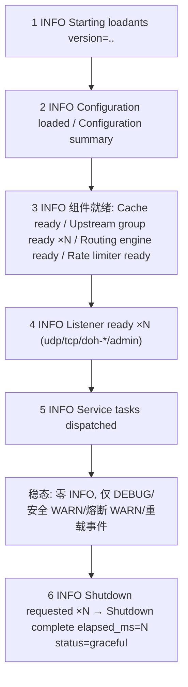

# loadants 日志输出规范（Logging Standard Spec）

> **文档类型**: 规范型规格（Normative Spec）— L4 实施的单一信息源（SSOT）
> **Enabled Profiles**: solution / ops / sec
> **版本**: v1.0 ｜ **状态**: Final（L1 意图消歧/问题调研/方案发散/产品验证已收敛，本文档不含待决选项）
> **技术栈**: Rust ｜ `tracing = 0.1` + `tracing-subscriber = 0.3`（env-filter）
> **关联文档**: `specs/dns-forwarder-enhancements.md`（G1/AC-1.1 熔断器日志契约，本规范冻结该契约）

**规范语言约定**: 文中「必须」= MUST（L4 强制实现）；「禁止」= MUST NOT；「允许」= MAY（仅此一种可选写法之外的许可）。所有行号均为**规格撰写时 HEAD 的参考位置**；实施时若行号漂移，以函数/符号名定位为准。所有日志消息与字段示例保留英文原文。

---

## 1. 目标与范围

### 1.1 背景

loadants 是 Rust 实现的轻量 DNS 转发器（UDP/TCP → DoH），部署形态以 Docker/K8s 为主，运维排障入口是 `docker logs -f` / `kubectl logs -f` 的**人类可读纯文本日志**。

当前日志现状（规格撰写时统计）：

| 统计项 | 数值 |
|--------|------|
| 全项目日志调用点 | 约 176 处（error 42 / warn 53 / info 36 / debug 45 / trace 0） |
| 分布文件数 | 19 个 |
| 已有 per-request span | 3 个：`dns_query`（src/server.rs，字段 client_ip/query/qtype）、`doh_query` × 2（src/doh/handlers.rs GET/POST，字段 client_ip/method） |
| 结构化正例模板 | src/handler.rs 请求路径 kv 日志、src/balancer.rs 熔断迁移日志 |
| tests/ 日志断言 | 无（本规范维持现状，不引入 tracing-test） |

核心问题：级别语义不统一（per-request 失败出现在 WARN/ERROR）、info 稳态噪声、错误重复打印、凭据泄露点、缺少安全事件日志（admin 401 完全静默）、措辞与字段格式不一致。

### 1.2 目标（可验证）

| # | 目标 | 验收标准（摘要，完整见附录 B DoD） |
|---|------|-----------------------------------|
| G1 | 级别语义全项目统一校准 | 所有调用点符合 §3 级别语义；请求实例失败零 WARN/ERROR（安全例外与指定聚合点除外） |
| G2 | info 稳态干净 | 默认级别（loadants=info）稳态运行 ≤ 每分钟数条 INFO，且零 per-request INFO |
| G3 | 凭据零泄露 | §4.5 屏蔽清单 100% 执行；全量日志输出中 grep 不到任何凭据/userinfo |
| G4 | 格式约定全覆盖 | 所有日志：固定短语消息 + kv 字段 + 统一时长字段 + 「Failed to X」错误措辞 |
| G5 | 修复全部 P0/P1/P2 | §7 实施要求清单中 P0（3 项）、P1（7 项）、P2（1 项）全部落地 |
| G6 | 零副作用约束 | 不新增直接依赖；AppError 类型不变；src/balancer.rs 熔断日志契约冻结；init_logging 零改动 |

### 1.3 范围边界

**In-Scope**：全仓库所有 `error!/warn!/info!/debug!/trace!` 调用点的级别校准、消息与字段格式归一、§5 生命周期日志链、§6 高频路径策略、§7 实施要求、附录 A 变更映射表对应的 CHANGELOG 产出要求。

**Out-of-Scope（明确不做）**：

| # | 排除项 | 说明 |
|---|--------|------|
| OOS-1 | AppError 类型层 source chain 修复 | 属后续独立项；本规范仅约定日志侧打印方式（§4.4），不改错误枚举类型 |
| OOS-2 | JSON 输出、日志轮转、文件输出、日志采集器配置 | 仅面向 stdout/stderr 纯文本 |
| OOS-3 | 新增任何直接依赖 | 含 tracing-test、tower-http、chrono 等 |
| OOS-4 | 新增聚合状态检测逻辑（除 §5.6 关停计时器与 BOOT-04 空路由表检查外） | 统计类信息交给 Prometheus；不新增聚合日志任务 |
| OOS-5 | 新增 Prometheus 指标 | 仅复用既有指标（§8 引用既有指标名） |
| OOS-6 | tests/ 新增日志断言 | 维持零断言现状 |
| OOS-7 | 修改 per-request span 的定义 | 复用既有 3 个 span；不为无 span 的 `handle_json_get` 新增 span |

### 1.4 术语

| 术语 | 定义 |
|------|------|
| **kv 字段** | tracing 结构化字段语法 `key = value` / `key = %expr`（Display）/ `key = &e as &dyn Error`，与消息正文分离 |
| **固定短语消息** | 日志消息正文只含静态英文短语（动词短语），不含任何动态值插值 |
| **最终处理层** | 某错误被最终处置（不再向上传播）的代码层；请求路径的唯一 error! 聚合点见 §4.4 |
| **请求实例失败** | 单个 DNS/DoH 请求在处理过程中失败（含上游失败、解析失败、限流、发送失败等） |
| **状态转换** | 组件级状态机迁移（如熔断器 healthy→unhealthy），与单个请求无关 |
| **安全例外** | §3.3 定义的三类保留 WARN 的安全检测日志（缓存投毒/0x20 校验失败/deny_answers 全过滤） |
| **稳态** | 启动完成、无配置变更、无规则重载、无故障的服务运行期 |

---

## 2. 格式决策（冻结项，零改动）

以下为已收敛决策，L4 **禁止**改动 `init_logging`（src/main.rs:23-38）的任何配置：

| # | 项 | 现状 | 决策 |
|---|----|------|------|
| F1 | 输出格式 | tracing-subscriber fmt 默认 Full 格式 | 保持（纯文本人类可读） |
| F2 | 时间戳 | 默认 timer：UTC、微秒精度（如 `2026-08-10T12:34:56.123456Z`） | 保持（禁止引入本地时区/chrono） |
| F3 | target | fmt 默认保留 | 保持 |
| F4 | 行号 | `with_line_number(false)` | 保持 |
| F5 | 颜色 | `with_ansi(false)` | **保持，禁止 ANSI 自适应**（不做 TTY 探测、不启用 with_ansi(true) 的任何路径） |
| F6 | 级别过滤 | `EnvFilter::try_from_default_env()`（RUST_LOG 覆盖），兜底 `loadants=info`（默认）/ `loadants=debug`（`--debug` 参数） | 保持。注意：兜底过滤器为 target 作用域，第三方 crate（hickory/axum/tokio 等）默认静默，仅 RUST_LOG 显式配置时输出 |
| F7 | per-request span | `dns_query`（server.rs:58-66）、`doh_query`×2（doh/handlers.rs GET:145-149 / POST:262-266） | 复用，禁止修改字段定义；`handle_json_get` 无 span，保持无 span |
| F8 | JSON 输出 | 无 | **禁止引入**（用户硬约束 #1） |

> **注**：启动时**不**回显生效日志级别（已裁决：避免过度设计，P1 裁决项）。

---

## 3. 级别语义（全项目统一校准，S1）

### 3.1 五级判定标准

| 级别 | 判定标准 | 本项目场景 |
|------|----------|-----------|
| **ERROR** | 服务能力受损需运维立即介入，**且非单请求维度** | 启动失败（参数非法/配置非法/端口绑定失败/组件构建失败）；全部上游组不可用；router 零规则（BOOT-04）；后台任务 panic 捕获；关停失败；配置不变量破坏（启动期检出） |
| **WARN** | 已降级但自愈的**状态/转换级**异常，非请求级 | 单 upstream 熔断 trip/transition；远程规则源加载失败但有 fallback；DoH 未启用 TLS；关停超时；快照持久化失败；§3.3 三类安全检测 |
| **INFO** | 低频生命周期里程碑，稳态 ≤ 每分钟数条 | 启动横幅/配置摘要/组件就绪/监听就绪/规则重载完成/关停开始与完成 |
| **DEBUG** | 单请求全链路 + 高频内部行为 | 收查询/路由命中/缓存 hit-miss-stale/上游 attempt 与重试/解析完成/限流命中/后台刷新/请求实例失败/malformed 请求 |
| **TRACE** | 字节/线缆级细节 | DoH JSON 应答的 comment、EDNS/ECS 选项逐值输出 |

> TRACE 场景说明：本轮仅 upstream/json.rs 两处（UJS-02）落入 TRACE。DNS wire 级解析细节位于第三方 crate（hickory）内部，不受本规范约束。

### 3.2 裁决规则（强制）

1. **请求实例失败永远不进 WARN/ERROR**：由 metrics 计数 + DEBUG 记录。唯一例外是 §4.4 指定的请求路径最终 error! 聚合点（handler.rs handle_forward，重试耗尽且最终 SERVFAIL 时才发出）。
2. **ERROR 只描述能力丧失，WARN 只描述状态转换**。WARN 中禁止出现逐请求计数的内容；ERROR 中禁止出现请求标识字段（client_ip/query）。
3. **统计归 Prometheus，日志只记状态转换与生命周期**：禁止新增周期性聚合/汇总日志任务；既有 metric 覆盖的事件（限流、发送失败、路由失败、上游错误）日志级别不得高于 DEBUG。
4. **启动期可检出但运行期逐请求触发**的配置不变量错误（如 manager.rs 请求路径的 5 处 error!）：转发路径一律 DEBUG，依赖上游组/路由初始化时的既有日志暴露问题（P0-3 裁决，不引入新校验逻辑）。

### 3.3 安全异常例外条款（保留 WARN，清单封闭）

以下三类日志**必须保留 WARN**，且禁止降级：

| # | 位置（参考） | 事件 | 保留理由 |
|---|-------------|------|----------|
| SEC-1 | src/cache.rs:472 | 缓存投毒检测：应答记录全部因域名不匹配被拒绝 | 无 metric 覆盖，是 DNS 劫持/污染的唯一证据链 |
| SEC-2 | src/upstream/dns_client.rs:188 / :201 | 0x20 大小写校验失败（大小写不匹配 / 缺失 question section） | 同上，疑似伪造响应 |
| SEC-3 | src/upstream/manager.rs:303 / :404 | deny_answers 过滤后 A/AAAA 全部被拒（DoH 分支 + DNS 分支共 2 处） | 同上，疑似污染应答 |

**语义界定**：三类事件属「外部异常状态的发现」而非「请求实例失败」，故不适用 §3.2 规则 1。

**与安全例外的区分（已裁决）**：src/upstream/dns_client.rs:286 「0x20 strict 模式丢弃 UDP 回退 TCP」是**传输行为**（校验失败的后续处理动作，本身不证明劫持），降级 DEBUG（见 DNSC-03）。

**封闭性**：安全例外清单是**封闭集合**。本轮实施禁止将清单外的任何日志升格为安全例外；§7 中其余安全相邻检测（cache.rs 部分记录拒绝、CNAME 深度限制、恢复条目解析失败）按请求实例/数据面事件处理（DEBUG）。

**安全例外日志的格式要求**：级别与语义冻结，但须符合 §4 内容约定（kv 化、消除位置占位）；既有措辞允许保留（已评审），字段按 §4.2 词表对齐。

### 3.4 冻结契约（src/balancer.rs，禁止改动）

src/balancer.rs `observe_state_call()`（参考 L98-149，其中 `warn!` L131-138、`info!` L140-146）的熔断器状态迁移日志是 `specs/dns-forwarder-enhancements.md` **G1/AC-1.1 已签署契约**：

> G1 验收标准：每次 H→U / U→HO / HO→H / HO→U 迁移产生 1 条 `warn!`/`info!` 日志 + 1 次 metric 递增。

- 现状：`(2,0)|(1,0)` 迁移（转入 Unhealthy）→ `warn!("Circuit breaker tripped")`；其余迁移 → `info!("Circuit breaker transition")`；字段 `group/server/from/to`；与 `circuit_breaker_transitions_total`、`upstream_health_state` metric 联动。
- **本轮要求：零改动**（级别、消息、字段、发出条件、metric 联动全部冻结，diff 层面不触碰该函数）。
- 该日志作为「WARN = 状态转换」的**参考模板**：kv 结构化、状态迁移语义、无请求标识字段。

---

## 4. 内容约定（S2）

### 4.1 消息措辞

| 规则 | 要求 |
|------|------|
| R1 | 消息正文为**动词短语**，首字母大写，无句点 |
| R2 | 消息正文只放**固定短语**；动态值一律以 kv 字段表达，**禁止** `{}` 位置占位符拼接动态值（`format_args!` 插值消息同样禁止） |
| R3 | **错误/失败类消息统一为 `"Failed to <verb> ..."` 风格**（本项目现有最高频模板，42 处 error! 中多数已采用；语义明确指向未完成的动作）。废弃其余三种模式并归一：`"X failed"`（如 Upstream request failed）、`"Error X-ing"`（如 Error sending response）、`"X error"`（如 Application shutdown error） |
| R4 | **状态宣告类**消息（检测/迁移/完成）允许「主语+动词」句式，与既有参考模板一致（如 `Circuit breaker tripped`、`Cache poisoning detected`、`Listener ready`、`Shutdown complete`）；失败类禁止使用该句式 |
| R5 | 同一事件在多处出现时消息文本必须一致（如 5 处发送失败统一 `Failed to send response`） |

### 4.2 受控字段词表（与 metrics 标签对齐）

请求路径与状态类日志的字段名**仅限**下表；词表外字段禁止出现在请求路径：

| 字段 | 含义 | 值约定 |
|------|------|--------|
| `client_ip` | 客户端 IP | 仅 IP，不含端口 |
| `query` | 查询域名 | 字符串（含尾点与否随来源，不强制归一） |
| `qtype` | 查询类型 | 如 `A`/`AAAA`/`HTTPS` |
| `protocol` | 入站协议 | `udp` / `tcp` / `doh` |
| `transport` | 监听/上游传输 | 监听：`udp`/`tcp`/`doh-http`/`doh-https`/`admin`；上游：`udp`/`tcp`/`http` |
| `addr` | 监听地址或服务器地址 | 含端口 |
| `group` | 上游组名 | 配置中的组名 |
| `server` | 上游服务器标识 | DoH = 剥离 userinfo 后的 URL；DNS = `ip:port` |
| `attempt` | 当前尝试序号 | 1 起 |
| `max_attempts` | 最大尝试次数 | 整数 |
| `duration_ms` | 请求路径耗时 | f64 毫秒（见 §4.3） |
| `elapsed_ms` | 生命周期事件耗时 | u64 毫秒（见 §4.3） |
| `rcode` | DNS 响应码 | 复用既有 `normalize_response_code()` 输出（`NOERROR`/`SERVFAIL`/`NXDOMAIN`/`REFUSED` 等） |
| `cached` | 是否缓存来源 | bool（预留，本轮无新增使用点） |
| `version` | 版本号 | `env!("CARGO_PKG_VERSION")` |
| `path` | 文件路径 | 配置文件路径等 |
| `url` | URL | **剥离 userinfo 后**输出（§4.5） |
| `sockets` | UDP socket 数 | 整数 |
| `status` | 结果状态 | 如 `graceful`/`error`/`timeout`/`ok` |
| `reason` | 原因枚举 | 固定小写短语（如 `group_not_found`/`case_mismatch`） |
| `error` | 错误 | 最终层用 `&e as &dyn std::error::Error`（§4.4）；DEBUG 层允许 `%e` |

**扩展规则**：生命周期/组件就绪阶段允许在词表外补充领域字段，必须 snake_case，带单位的必须带单位后缀（如 `max_entries`、`min_ttl_s`、`rules`、`sources_ok`、`active_ips`）。

**span 字段非重复规则**：当前 span 前缀已包含的字段，事件日志禁止重复输出（`dns_query` 含 client_ip/query/qtype；`doh_query` 含 client_ip/method）。**唯一例外**：`record_doh_metrics`（doh/handlers.rs）因被无 span 的 `handle_json_get` 共用而保留 `client_ip` 字段。后台任务经 `tokio::spawn` 脱离 span 上下文（见 HDL-05），其日志**必须**显式携带 `query` 字段。

### 4.3 时长统一

| 场景 | 字段 | 类型/格式 | 示例 |
|------|------|-----------|------|
| 请求路径耗时（查询解析、缓存检查、上游转发、DoH 处理） | `duration_ms` | f64，毫秒 | `duration_ms=3.421` |
| 生命周期事件耗时（规则重载、关停） | `elapsed_ms` | u64，毫秒 | `elapsed_ms=1834` |

禁止 `duration = ?Duration` 的 Debug 渲染（`{:?}` 输出 `3.421s` 形式）；现有 `duration = ?start_time.elapsed()`、`cache_check_duration = ?...` 等一律按上表归一（子阶段耗时统一并入 `duration_ms`，不保留 `*_duration` 变体名）。

### 4.4 错误打印规范

1. **错误只在最终处理层记录一次**；中间层只传播 `Err`，至多 DEBUG。
2. **请求路径的最终处理层**指定为 src/handler.rs `handle_forward()`：这是请求路径唯一的 `error!` 聚合点，仅在**上游重试耗尽且 stale fallback 未救回、最终返回 SERVFAIL** 时发出（见 HDL-09）。
3. **启动/生命周期路径的最终处理层**为 main.rs 中 `process::exit(1)` 前的 `error!`（各启动失败分支），保持一次一错。
4. **source chain 输出**：最终层必须使用
   ```rust
   error!(group = %target_group, error = &e as &dyn std::error::Error, "Failed to forward request to upstream");
   ```
   tracing 字段机制会自动输出 `error=<Display>` + `error.sources=[...]` 完整链；`%e`/`{}` 只打印顶层错误，**禁止用于最终层**（DEBUG 级别的中间层为简洁允许 `%e`）。
5. **现状说明**：当前 AppError 多数变体无 source，`error=` 自动退化为 `error=<Display>`，本约定不受影响；类型层 source chain 修复为后续独立项（OOS-1）。

### 4.5 脱敏规范（屏蔽清单，强制）

| # | 屏蔽对象 | 规则 |
|---|----------|------|
| M1 | `admin.auth.token` | **永不输出**（含配置摘要、错误消息、admin 认证失败日志） |
| M2 | `remote_rules.sources[].auth`（basic/bearer 凭据） | **永不输出** |
| M3 | proxy URL 凭据（`http_client.proxy` 中的 `user:pass@`） | 打印前必须剥离 userinfo（HTTPC-01 修复现存 Debug 泄露点） |
| M4 | 任意 URL 的 userinfo（`user:pass@`） | 打印前剥离，保留 `scheme://host[:port]/path`；上游 server URL、远程规则源 URL、proxy 均适用 |
| M5 | 配置文件内容 | 只打路径与计数/开关摘要；**禁止** Debug/Display 序列化 `Config` 或其子结构整体 |

**配置摘要的脱敏边界**：§5.2 的配置摘要只允许出现监听地址、开关（on/off）、计数（upstream_groups/remote_rule_sources）；禁止出现 token、auth 配置、proxy URL 原文、TLS 文件**内容**（路径允许）。

---

## 5. 生命周期日志链（S3）

启动→稳态→关停的完整日志序列如下。每阶段给出级别、模板（kv 示意）与验收要点。



> 图示回答的问题：一次完整生命周期中 INFO 日志的**先后序列**与稳态期的内容构成。

### 5.1 阶段 1：启动横幅（INFO）

- **模板**: `Starting loadants version=<CARGO_PKG_VERSION>`
- **实现**: src/main.rs L59，字段 `version = env!("CARGO_PKG_VERSION")`，消息 `Starting loadants`。
- **验收要点**: 横幅必须是进程第一条日志；包含 `version=` 字段（P1 修复项）；不回显生效日志级别；不打印 logo/多行文本。

### 5.2 阶段 2：配置加载（INFO × 2 行）

- **模板**:
  1. `Configuration loaded path=<配置文件路径>`
  2. `Configuration summary listen_udp=<addr> listen_tcp=<addr> listen_http=<addr|none> doh=<on|off> cache=<on|off> cache_max_entries=<N> upstream_groups=<N> remote_rule_sources=<N> rate_limit=<on|off>`
- **实现**: src/main.rs L63 现有的单行 `{:?}` 日志替换为上述两行（MAIN-02）。
- **验收要点**: 只有路径与计数摘要（M5）；`doh` 开关等价于 `listen_http` 是否配置；`cache=off` 时 `cache_max_entries=0`；无 token/auth/proxy 字段。

### 5.3 阶段 3：组件就绪（INFO，每组件一行/每上游组一行）

| 组件 | 触发点 | 模板 |
|------|--------|------|
| 缓存 | src/cache.rs `DnsCache::new`（L275 现有改 kv） | `Cache ready max_entries=<N> min_ttl_s=<N> max_ttl_s=<N> negative_ttl_s=<N> stale_while_revalidate_s=<N>` |
| 上游组 | src/upstream/manager.rs `UpstreamManager::new` 组构建循环内（**新增**，每组一行） | `Upstream group ready group=<name> scheme=<doh\|dns> strategy=<roundrobin\|weighted\|random> servers=<N>` |
| 路由引擎 | src/bootstrap.rs `build_router`（L47/L56 归一） | `Routing engine ready rules=<N> static_rules=<N> remote_rules=<N>`（无远程源时 `remote_rules=0`） |
| 限流器 | src/main.rs rate_limiter 构建处（L246 改 kv） | `Rate limiter ready max_rps=<N> per_ip_rps=<N>` |
| admin 地址 | src/main.rs L183（使用默认地址时） | `Admin listen address defaulted addr=<default>` |

`scheme`/`strategy` 取值必须与 `group_summary()` 现有字符串一致（`doh`/`dns`；`roundrobin`/`weighted`/`random`）。

**验收要点**: 组件就绪行在组件构建成功后立即输出；上游组一行一组（组数 = 日志行数）；稳态不重复出现。

### 5.4 阶段 4：监听就绪（INFO，每监听器一行）

- **模板**: `Listener ready transport=<udp|tcp|doh-http|doh-https|admin> addr=<addr>`；`transport=udp` 时追加 `sockets=<N>`。
- **位置映射**:

| 监听器 | 现有位置 | 目标 |
|--------|----------|------|
| UDP 汇总 | src/server.rs L401 | `Listener ready transport=udp addr=.. sockets=N` |
| UDP 逐 socket | src/server.rs L387（现为 INFO） | **降 DEBUG**：`UDP socket bound addr=.. index=<i>`（1 起） |
| TCP | src/server.rs L409 | `Listener ready transport=tcp addr=..` |
| DoH HTTPS | src/doh/server.rs L86 | `Listener ready transport=doh-https addr=..`；**位置修正**：现日志在 `bind_rustls`（L91）之前输出，必须移至 bind 之后（先绑定、后宣告） |
| DoH HTTP | src/doh/server.rs L116 | `Listener ready transport=doh-http addr=..` |
| Admin | src/admin.rs L159 | `Listener ready transport=admin addr=..` |

**验收要点**: 每个 `Listener ready` 必须在该监听器**实际 bind 成功之后**输出（P1 transport 字段区分 HTTPS/HTTP 两分支）；`Listener ready` 行是服务就绪的**唯一证据**；UDP 逐 socket 细节在 DEBUG 可见、INFO 只有汇总。

### 5.5 阶段 5：稳态宣告（INFO，时序修订）

- **模板**: `Service tasks dispatched`
- **位置**: src/main.rs L109（P0-2 修复）。
- **时序修订裁决**：该行现先于 `handle_shutdown_requests`（子系统实际启动并 bind）执行，「All services started」构成就绪误导。**选择改措辞而非移位**：移到各 listener ready 之后需要跨任务就绪同步屏障（违反「不引入额外就绪同步机制、不过度设计」约束）；因此改为派发宣告语义，并明示——**该日志不构成就绪证据，就绪证据是各 `Listener ready` 行**。
- **验收要点**: 消息不得含 `started`/`ready`/`waiting` 等就绪暗示词；位置保持在 Toplevel 构建后（不变动代码结构）。

### 5.6 阶段 6：关停（INFO）

序列：关停开始 → 各子系统停止（现有）→ 关停完成。

| 事件 | 模板 |
|------|------|
| 关停开始（各子系统，现有保留） | `Shutdown requested subsystem=<dns_server\|admin_server\|doh_server>`（消息统一，字段取 `subsystem_names` 常量值） |
| 子系统停止 | `DNS server stopped status=<graceful\|error\|timeout>`；`Admin server stopped status=<graceful>`；`DoH server stopped status=<graceful>`（关停超时/错误时 status=timeout/error，级别 WARN——属「关停超时」WARN 场景） |
| 关停完成（main.rs） | 成功：`Shutdown complete elapsed_ms=<N> status=graceful`（INFO）；失败：`Shutdown failed elapsed_ms=<N> status=error error=<chain>`（ERROR） |

**elapsed_ms 计时实现（唯一允许的新机制）**：main.rs Toplevel 闭包内新增一个最小 watcher 子系统（名称常量 `subsystem_names::SHUTDOWN_TIMER = "shutdown_timer"`，src/const.rs 新增），其逻辑仅为：`on_shutdown_requested().await` → 将当前 `Instant` 写入共享单元（如 `Arc<std::sync::Mutex<Option<Instant>>>`）→ 返回 `Ok(())`。`handle_shutdown_requests` 返回后由 main 读取该 Instant 计算 `elapsed_ms`。该子系统不引入同步屏障、不改变关停流程语义（关停期退出为安全行为）、无新依赖。

**验收要点**: 从任一子系统收到关停请求到进程退出，存在一条可拼接的关停链（Shutdown requested × N → 子系统 stopped × N → Shutdown complete）；`elapsed_ms` 为关停阶段耗时（非进程 uptime）。

### 5.7 阶段 7：周期任务（远程规则重载）

| 事件 | 级别 | 模板 |
|------|------|------|
| 重载开始（main.rs L328，现 INFO） | **DEBUG** | `Remote rules reload started` |
| 重载成功（main.rs L426 归一，P1 补 rules=N） | INFO | `Remote rules reload completed rules=<N> sources_ok=<N> sources_failed=<N> elapsed_ms=<N>` |
| 重载整体失败（main.rs L368 保留 WARN，kv 化） | WARN | `Failed to reload remote rules elapsed_ms=<N> error=<chain>`（保留旧 Router 为行为约定，不入消息文本） |
| 重建 Router 失败 / 评估失败（main.rs L429/L436） | WARN | `Failed to build router from reloaded rules error=<chain>` / `Failed to evaluate reloaded rules error=<chain>` |
| 单源加载失败（remote_rule/mod.rs L157/L199，现 error!） | **WARN**（降级） | `Failed to load remote rule source` / `Failed to create remote rule loader`，字段保留 `url/action/failure_policy/error/fallback_hint`（url 按 M4 剥离） |
| 单源加载成功（remote_rule/loader.rs L167 归一） | INFO | `Remote rule source loaded rules=<N> url=<redacted-url> exact=<N> wildcard=<N> regex=<N>` |
| 快照目录同步/持久化失败（remote_rule/mod.rs L94/L117） | WARN（保留，已 kv） | 消息与字段维持现状 |
| 启动期部分降级逐源记录（bootstrap.rs L32） | WARN（保留，已 kv，参考模板） | 消息与字段维持现状 |

级别依据：重载属低频后台生命周期事件——开始 DEBUG、结果 INFO、失败 WARN（「远程规则源加载失败但有 fallback」属 WARN 状态级降级；旧 Router 持续服务即自愈）。

**验收要点**: `rules=N` 必须出现于成功日志（P1）；`elapsed_ms` 覆盖「加载开始 → Router 原子替换完成」区间。

---

## 6. 高频路径策略（S4）

### 6.1 总则

1. 请求级日志只允许 DEBUG（用户硬约束 #4：info 不输出每请求日志）。
2. span 内不重复输出 span 前缀已含字段（§4.2 规则与唯一例外）。
3. 错误只打一次（§4.4）：manager 与 handler 的重复 error 归一到 handler 最终层（含 `group` 字段），manager 内部请求路径 error! 全部降 DEBUG。
4. 统计类信息交给 Prometheus；日志只记状态转换与生命周期；**不新增聚合日志任务**。

### 6.2 逐条裁决

| # | 事项 | 裁决 | 依据 |
|---|------|------|------|
| H1 | UDP/TCP 限流命中（server.rs L85 per-request warn） | **降 DEBUG**：`Rate limit hit protocol=<udp\|tcp>`（client_ip 取自 span） | metrics `dns_request_errors_total` 已计数 |
| H2 | DoH 三处限流静默（handlers.rs GET L157 / POST L275 / JSON L392） | **补 DEBUG**：`debug!(protocol = "doh", method = "GET"/"POST"/"JSON", "Rate limit hit")`；`handle_json_get`（无 span）额外携带 `client_ip = %addr.ip()` | 与 UDP/TCP 一致 + 可排查；metrics 已计数 |
| H3 | DoH 400 畸形请求静默 | **补 DEBUG**：`handle_doh_get` 与 `handle_json_get` 的 Query 提取器改为 `Result<Query<T>, QueryRejection>` 包裹，提取失败时输出 `debug!(client_ip=.., error=%rej, "Failed to parse query parameters")` 后返回原拒绝响应（axum 0.8 支持该模式，零新依赖）。处理器内部已产生的 400/415/500 由 record_doh_metrics 的降级日志覆盖（H8） | 当前提取器层拒绝完全无日志 |
| H4 | admin 认证失败 401 静默 | **补 WARN**（P0-1）：`Admin authentication failed client_ip=<peer> path=<uri path> method=<HTTP method>`；token 永不输出（M1） | 安全事件；当前完全静默 |
| H5 | 缓存投毒 / 0x20 校验失败 / deny_answers 全过滤 | **保留 WARN**（§3.3 安全例外，封闭清单） | 无 metric 覆盖；DNS 劫持/污染唯一证据链 |
| H6 | 上游单 attempt 失败/重试（manager.rs L315/L416，已有 DEBUG） | 保留 DEBUG，字段统一为 `group/server/attempt/max_attempts/error` | 与词表对齐 |
| H7 | 上游出站响应成功摘要（manager.rs 两处 Ok 分支，现为空白） | **新增 DEBUG**：`Upstream response received group=.. server=.. transport=<udp\|tcp\|http> rcode=.. answers=<N> duration_ms=<f64>`；duration_ms = 本次 forward 全部 attempt 耗时之和（DoH 分支为 start_time.elapsed()） | rcode 与 answer 数是劫持比对的支撑数据 |
| H8 | DoH 请求处理结果日志（record_doh_metrics L628 error! / L636 warn! / L615 debug!） | 全部**归一为 DEBUG**；`duration = ?..` → `duration_ms=<f64>`；字段保留 client_ip/status_code/error_type | 请求实例失败；metrics `http_request_errors_total`/`http_requests_total` 已计数 |
| H9 | upstream/json.rs 逐记录解析 warn（11 处） | **降 DEBUG** | 上游畸形应答属数据面噪声（裁决冲突记录见附录 C-1） |
| H10 | dns_client.rs TCP 连接池驱逐 warn（L459） | **降 DEBUG**：`TCP connection pool evicted oldest connection addr=.. pool_size=<N>`（`evicted_addr` 归一为 `addr`） | 常规容量管理行为 |
| H11 | server.rs 5 处 `Error sending response`（error!） | **降 DEBUG**（P1 裁决）：统一措辞 `Failed to send response`，字段 `client_ip`（=%request.src().ip()）+ `protocol=<udp\|tcp>` | UDP 客户端消失是常态；持续失败由 metrics 体现；避免每请求 error 洪流 |
| H12 | server.rs L176 请求解析失败（error!） | **降 DEBUG**（裁决规则 1）：`Failed to parse request message client_ip=.. protocol=..`（P1：显式补 client_ip——span 的 query 字段取自 `unwrap_or_default()`，malformed 请求下为空字符串，显式字段保证排障证据不依赖 span 提取结果） | 畸形客户端包属请求实例失败；metrics REQUEST_ERROR 已计数 |
| H13 | server.rs L258 `Error processing DNS request`（error!） | **降 DEBUG**：与 handler 最终层去重（handler.rs 覆盖路由/上游类失败的具体日志） | 错误只打一次 |

---

## 7. 实施要求清单（按文件分组）

优先级标注：`P0` = 用户清单 P0；`P1` = 用户清单 P1；`P2` = 用户清单 P2；`SEC` = 脱敏强制项；`ADJ` = 级别校准（§3 裁决规则的机械应用）；`NORM` = 格式归一（§4）。除注明「新增」「位置移动」外，均为对现有调用点的就地修改。**不得修改 src/balancer.rs 的 `observe_state_call()`（§3.4 冻结契约）**。

### 7.1 src/main.rs

| ID | 位置 | 优先级 | 要求 |
|----|------|--------|------|
| MAIN-01 | L59 banner | P1 | `info!(version = env!("CARGO_PKG_VERSION"), "Starting loadants")` |
| MAIN-02 | L63 配置加载 | NORM/SEC | 替换为 §5.2 两行模板；`path = %args.config.display()`；禁止 `{:?}`；禁止输出配置结构内容 |
| MAIN-03 | L47/67/73/85/167/175 启动 error! | NORM | 保留 ERROR（最终层）；kv 化 + error chain（§4.4）；措辞统一「Failed to X」：`Failed to validate command line arguments` / `Failed to load configuration file`（已符合）/ `Failed to validate configuration` / `Failed to create application components`（已符合）/ `Failed to initialize upstream manager`（已符合）/ `Failed to initialize routing engine`（已符合） |
| MAIN-04 | L109 稳态宣告 | P0-2 | 按 §5.5 改为 `info!("Service tasks dispatched")`；位置不动 |
| MAIN-05 | L116/L120 关停完成 | NORM | 按 §5.6：`Shutdown complete elapsed_ms status=graceful` / `Shutdown failed elapsed_ms status=error error=<chain>` |
| MAIN-06 | Toplevel 闭包 | NORM | 新增 `shutdown_timer` watcher 子系统（§5.6 计时实现） |
| MAIN-07 | L183 admin 默认地址 | NORM | kv：`info!(addr = server_defaults::DEFAULT_ADMIN_LISTEN, "Admin listen address defaulted")` |
| MAIN-08 | L246 限流器 | NORM | `info!(max_rps = ..., per_ip_rps = ..., "Rate limiter ready")` |
| MAIN-09 | L303-309 panic guard | NORM | kv：`error!(task = %task_name, error = &e as &dyn std::error::Error, "Task iteration panicked")`（panic 捕获属 ERROR 场景；保留旧 Router 为行为约定，不入消息）；`warn!(task = %task_name, error = %e, "Task cancelled")` |
| MAIN-10 | L328 重载开始 | ADJ | INFO → **DEBUG**：`Remote rules reload started` |
| MAIN-11 | L368 重载失败 | NORM | 保留 WARN；kv：`warn!(elapsed_ms = ..., error = %e, "Failed to reload remote rules")` |
| MAIN-12 | L426 重载成功 | P1 | 保留 INFO；`info!(rules = ..., sources_ok = ..., sources_failed = ..., elapsed_ms = ..., "Remote rules reload completed")`（计数取自 summary） |
| MAIN-13 | L429/L436 重建/评估失败 | NORM | 保留 WARN；kv + error 字段：`Failed to build router from reloaded rules` / `Failed to evaluate reloaded rules` |

### 7.2 src/const.rs

| ID | 优先级 | 要求 |
|----|--------|------|
| CONST-01 | NORM | `subsystem_names` 新增常量 `SHUTDOWN_TIMER: &str = "shutdown_timer"` |

### 7.3 src/server.rs

| ID | 位置 | 优先级 | 要求 |
|----|------|--------|------|
| SRV-01 | L85 限流 warn | ADJ | WARN → **DEBUG**：`debug!(protocol = %protocol, "Rate limit hit")`（client_ip 取自 `dns_query` span，不重复） |
| SRV-02 | L127/153/202/253/285 发送失败 error! × 5 | P1/ADJ | ERROR → **DEBUG**，5 处统一：`debug!(client_ip = %request.src().ip(), protocol = %protocol, "Failed to send response")`（显式字段为 P1 裁决） |
| SRV-03 | L176 解析失败 error! | P1/ADJ | ERROR → **DEBUG**：`debug!(client_ip = %request.src().ip(), protocol = %protocol, error = %e, "Failed to parse request message")` |
| SRV-04 | L258 处理失败 error! | ADJ | ERROR → **DEBUG**：`debug!(error = %e, "Failed to process request")`（与 handler 最终层去重） |
| SRV-05 | L350/355/360/365/370/375/379/396/413 socket/listener error! | NORM | 保留 ERROR（启动失败）；kv 化：`error = %e`（或 `&e as &dyn Error`）+ 相关上下文字段（addr） |
| SRV-06 | L387 per-socket info | ADJ | INFO → **DEBUG**：`debug!(addr = %addr, index = i + 1, "UDP socket bound")` |
| SRV-07 | L396 消息歧义 | NORM | 该处实为 `UdpSocket::from_std` 失败，消息改为 `Failed to register UDP socket`（与 L375 bind 失败区分） |
| SRV-08 | L401/L409 监听 info | NORM | 按 §5.4：`Listener ready transport=udp addr=.. sockets=<N>` / `Listener ready transport=tcp addr=..` |
| SRV-09 | L426/L428 服务器退出 | NORM | kv：`error!(error = ..., "Failed to run DNS server")` / `info!("DNS server completed")` |
| SRV-10 | L433/L440/L441/L442 关停 | NORM | L433 → `info!(subsystem = subsystem_names::DNS_SERVER, "Shutdown requested")`；L440 → `info!(status = "graceful", "DNS server stopped")`；L441 → `warn!(status = "error", error = %e, "DNS server stopped")`；L442 → `warn!(status = "timeout", "DNS server stopped")`（超时分支无 error 对象，不带 error 字段） |

### 7.4 src/admin.rs

| ID | 位置 | 优先级 | 要求 |
|----|------|--------|------|
| ADM-01 | L163 serve / L260 auth_middleware | **P0-1** | `axum::serve(listener, app)` 改为 `axum::serve(listener, app.into_make_service_with_connect_info::<SocketAddr>())`；`auth_middleware` 增加 `ConnectInfo<SocketAddr>` 参数；认证失败分支（L279-288）在返回 401 前输出 `warn!(client_ip = %addr.ip(), path = %request.uri().path(), method = %request.method(), "Admin authentication failed")`；token 与完整 Authorization 头内容**永不输出**（M1） |
| ADM-02 | refresh_cache_handler / cache_dump_handler / cache_restore_handler | P1 | 三个处理器增加 `ConnectInfo<SocketAddr>` 参数；日志补 `client_ip`：L318 → `info!(client_ip = ..., "Cache cleared")`；L451 → `info!(client_ip = ..., entries = ..., "Cache dumped")`；L491 → `info!(client_ip = ..., loaded = ..., skipped_expired = ..., failed = ..., "Cache restore completed")` |
| ADM-03 | L159 监听 info | NORM | `Listener ready transport=admin addr=..` |
| ADM-04 | L166/L195 关停 | NORM | `info!(subsystem = subsystem_names::ADMIN_SERVER, "Shutdown requested")`；`info!(status = "graceful", "Admin server stopped")` |
| ADM-05 | L124/L192 | NORM | L124 保留 INFO（无动态值）；L192 → `error!(error = &err as &dyn std::error::Error, "Failed to run admin server")` |

### 7.5 src/handler.rs

| ID | 位置 | 优先级 | 要求 |
|----|------|--------|------|
| HDL-01 | L100 收查询 debug | NORM | `debug!("Query received")`（span 已含 query/qtype/client_ip，消息去插值） |
| HDL-02 | L152/L199 block debug | NORM | `debug!("Query blocked")` |
| HDL-03 | L163/L224 解析完成 debug | NORM | `debug!(duration_ms = .., rcode = .., answers = .., "Query resolved")`（去掉 `query` 字段与 `duration = ?..`） |
| HDL-04 | L299/L317/L344 缓存 debug | NORM | `debug!("Cache hit")`；`debug!("Cache stale served, background revalidation scheduled")`；`debug!(duration_ms = .., "Cache miss")`（去掉 span 重复字段；`cache_check_duration` → `duration_ms`） |
| HDL-05 | L358/387/393/403/419/429/441/443/452 后台刷新 | ADJ/NORM | 全部 WARN/INFO → **DEBUG**（含 L443 info「Background revalidation completed」——硬约束 #4）；统一消息族 `Background revalidation started / completed / failed / skipped`，失败/跳过带 `reason = <no_cache_key\|no_query\|route_match_failed\|blocked\|missing_target\|cache_insert_failed\|upstream_failed>`；因 `tokio::spawn` 脱离 span，**必须**显式携带 `query` 字段；错误字段 DEBUG 层用 `%e` |
| HDL-06 | L484 路由匹配失败 warn | ADJ | WARN → **DEBUG**：`debug!(query = .., error = %e, "Failed to match route")`（metrics ROUTE_ERROR 已计数） |
| HDL-07 | L516 forward 缺 target error! | ADJ（P0-3 同类） | ERROR → **DEBUG**：`debug!(query = .., reason = "target_missing", "Failed to resolve forward target")`（metrics MISSING_TARGET 已计数；配置问题依赖启动期日志） |
| HDL-08 | L532 转发完成 debug | NORM | 字段归一：`group`（原 target_group）+ `duration_ms`；消息 `Upstream forwarding completed` |
| HDL-09 | L542 error! + L556 stale warn | **核心重构** | 调整为：`forward` 返回 Err 时先尝试 stale fallback；**stale 救回** → `debug!(group = %target_group, error = %e, "Stale response served after upstream failure")`（原 L556 warn 降级——级别表「缓存 stale」属 DEBUG）；**未救回** → `error!(group = %target_group, error = &e as &dyn std::error::Error, "Failed to forward request to upstream")` 后返回 SERVFAIL。该 error! 是请求路径唯一 error! 聚合点（§4.4），只在最终 SERVFAIL 时发出 |
| HDL-10 | L584 缓存插入失败 warn / L586 debug | ADJ/NORM | warn → **DEBUG**：`debug!(error = %e, "Failed to insert cache entry")`；L586 `cache_insert_duration = ?..` → `duration_ms`，去 query 字段 |

### 7.6 src/cache.rs

| ID | 位置 | 优先级 | 要求 |
|----|------|--------|------|
| CACHE-01 | L275 缓存创建 info | NORM | `info!(max_entries = size, min_ttl_s = min_ttl, max_ttl_s = max_ttl, negative_ttl_s = negative_ttl, stale_while_revalidate_s = stale_while_revalidate, "Cache ready")` |
| CACHE-02 | L472 投毒检测 warn | SEC-1 冻结级别 | 保留 WARN；kv 化：`warn!(query = %query_name.to_utf8(), reason = "all_answers_rejected", "Cache poisoning detected")`。**group 字段：本轮不穿透**（`insert()` 调用链不携带 group，修改签名属过度设计）——在 changelog「已知限制」注明（P1「尽力补 group」的裁决结论） |
| CACHE-03 | L508/L838 插入/恢复 debug | NORM | kv：`debug!(query = %key.name, qtype = %key.record_type, "Cache entry inserted" / "Cache entry restored")` |
| CACHE-04 | L539 debug rcode `{:?}` | NORM | `debug!(rcode = %response.response_code(), reason = "error_rcode", "Response not cacheable")` |
| CACHE-05 | L588/L614 TTL debug `{:?}` | NORM/P2 | kv：`debug!(ttl_s = ttl, soa_minimum_s = <Display：数值或 none>, rcode = "NXDOMAIN"/"NOERROR", "Negative cache TTL applied")`，消除 `{:?}` |
| CACHE-06 | L756/772/788/803 恢复解析 warn × 4 | ADJ | WARN → **DEBUG**（条目级数据噪声；聚合结果由 admin restore 响应/日志承载）：`debug!(query = %entry.name, reason = "parse_name"/"parse_record_type"/"decode_hex"/"parse_message", error = %e, "Failed to restore cache entry")` |
| CACHE-07 | L883 CNAME 深度 warn | ADJ | WARN → **DEBUG**：`debug!(query = .., reason = "cname_depth_limit", "CNAME chain depth limit reached")` |
| CACHE-08 | L903/924/957/974 部分记录拒绝 warn × 4 | ADJ | WARN → **DEBUG**（请求实例级数据面事件；投毒的判定性信号是 CACHE-02 的全拒绝）：`debug!(query = .., rejected = <N>, section = "answer"/"ns"/"additional", "Rejected mismatched records")` |

### 7.7 src/balancer.rs

| ID | 优先级 | 要求 |
|----|--------|------|
| BAL-01 | 冻结 | `observe_state_call()`（含 L131-146 两条日志）**零改动**（§3.4） |

### 7.8 src/upstream/manager.rs

| ID | 位置 | 优先级 | 要求 |
|----|------|--------|------|
| MGR-01 | L111 deny_answers 非法 CIDR warn | NORM | 保留 WARN（启动期配置降级）；kv：`warn!(group = %name, cidr = %s, error = %e, "Failed to parse deny_answers CIDR")` |
| MGR-02 | L185 转发 debug | NORM | kv：`debug!(group = %group_name, "Forwarding request to upstream group")` |
| MGR-03 | L190/206/242/271/342 请求路径 error! × 5 | **P0-3** | ERROR → **DEBUG**（配置不变量类错误，启动期可发现；避免每请求洪流；不引入新校验逻辑）：统一 `debug!(group = %group_name, reason = "group_not_found"/"select_failed"/"invalid_server_type"/"http_client_missing"[+error = %e（select_failed 时）], "Failed to select upstream path")`；保留各处既有 metrics 不变 |
| MGR-04 | L303/L404 deny_answers warn × 2 | SEC-3 冻结级别 | 保留 WARN；现有字段（group/query）保持；消息允许保留现状（`All A/AAAA answers filtered by deny_answers, returning SERVFAIL`） |
| MGR-05 | L278+（DoH Ok）/ L366+（DNS Ok） | H7 新增 | 两分支在 `report_success` 后新增出站摘要 DEBUG：`debug!(group = %group_name, server = %<剥离 userinfo>, transport = "http"(DoH)/"udp"\|"tcp"(DNS，取成功送达的 attempt), rcode = <normalize>, answers = response.answer_count(), duration_ms = <f64>, "Upstream response received")` |
| MGR-06 | L315/L416 attempt 失败 debug × 2 | NORM | 字段统一：`group` 追加，保留 `server/attempt/max_attempts/error`；消息归一 `Upstream request attempt failed`（两分支统一措辞，transport 语义由字段表达） |

### 7.9 src/upstream/dns_client.rs

| ID | 位置 | 优先级 | 要求 |
|----|------|--------|------|
| DNSC-01 | L169 随机化失败 warn | ADJ | WARN → **DEBUG**：`debug!(error = %e, "Failed to randomize query name")` |
| DNSC-02 | L188/L201 0x20 校验失败 warn × 2 | SEC-2 冻结级别 | 保留 WARN；kv 归一：`warn!(sent = %sent_name, received = %response_name, reason = "case_mismatch", "0x20 case verification failed")`；`warn!(sent = %sent_name, reason = "missing_question", "0x20 case verification failed")` |
| DNSC-03 | L286 0x20 strict 回退 warn | ADJ（已裁决） | WARN → **DEBUG**（传输行为，非安全证据）：`debug!("0x20 strict fallback to TCP")` |
| DNSC-04 | L459 连接池驱逐 warn | ADJ | WARN → **DEBUG**：`debug!(addr = %key, pool_size = <N>, "TCP connection pool evicted oldest connection")` |

### 7.10 src/upstream/json.rs

| ID | 位置 | 优先级 | 要求 |
|----|------|--------|------|
| UJS-01 | L175/193/213/223/239/243/268/272/282/292/298 warn × 11 | ADJ/P2 | WARN → **DEBUG**；逐处 kv 化（字段如 `section`/`record_type`/`data`/`error`），消息统一「Failed to parse ...」族；`{:?}` 全部消除（`Unsupported record type: {:?}` → `record_type = %<Display 或数值>`） |
| UJS-02 | L157 JSON comment debug / L336 ECS debug | NORM | DEBUG → **TRACE**（级别表 TRACE 场景「JSON comment / EDNS/ECS 选项」）：`trace!(comment = %comment, "DoH JSON response comment")`；`trace!(ecs = %ecs, "EDNS Client Subnet in DoH JSON response")` |

### 7.11 src/upstream/http_client.rs

| ID | 位置 | 优先级 | 要求 |
|----|------|--------|------|
| HTTPC-01 | L23-26 | **SEC** | 现存 `debug!("...config: {:?}, proxy: {:?}, retry_config: {:?}", ...)` 泄露 proxy 凭据（M3）且违反 R2。改为：`debug!(proxy = <剥离 userinfo 后的 proxy 或 "none">, retry = "on"/"off", "HTTP client created")`；**禁止**对 config/proxy/retry_config 做 Debug 整体序列化 |

### 7.12 src/doh/handlers.rs

| ID | 位置 | 优先级 | 要求 |
|----|------|--------|------|
| DOHH-01 | handle_doh_get L150 / handle_json_get L385 Query 提取器 | H3/P0 配套 | 提取器改为 `Result<Query<T>, QueryRejection>`；Err 分支输出 `debug!(client_ip = %addr.ip(), error = %rej, "Failed to parse query parameters")` 后返回拒绝响应（提取失败时 span 未生效，client_ip 必须显式） |
| DOHH-02 | L157/L275/L392 限流 × 3 | H2 | 各补 DEBUG（protocol 必须为字段，不进消息文本）：GET/POST `debug!(protocol = "doh", method = "GET"/"POST", "Rate limit hit")`（span 含 client_ip，不重复）；JSON `debug!(protocol = "doh", method = "JSON", client_ip = %addr.ip(), "Rate limit hit")`（无 span，显式携带） |
| DOHH-03 | L113 SERVFAIL warn | ADJ | WARN → **DEBUG**：`debug!(request_id = ..., error = %e, "Failed to process DNS query, returning SERVFAIL per RFC 8484")` |
| DOHH-04 | record_doh_metrics L615/628/636 | H8/ADJ | error!/warn! → **DEBUG**；三条统一字段：`client_ip`（保留——handle_json_get 无 span 的唯一例外）、`status_code`、`error_type`（如有）、`duration_ms = <f64>`（替换 `duration = ?..`）；消息归一：L615 `DoH request completed`；L628 `DoH request failed`（error_type 作字段）；L636 `DoH request failed` + 字段 `reason = "unspecified"`（reason 必须为 kv 字段，不进消息文本） |
| DOHH-05 | 全局 | NORM | 文件内所有 `{}`/`{:?}` 消息插值清零（以 kv 表达） |

### 7.13 src/doh/server.rs

| ID | 位置 | 优先级 | 要求 |
|----|------|--------|------|
| DOHS-01 | L86/L116 监听 info | P1 | 按 §5.4：`Listener ready transport=doh-https addr=..` / `Listener ready transport=doh-http addr=..`；**HTTPS 分支日志从 bind 前移至 `bind_rustls`（L91）之后** |
| DOHS-02 | L74/L78/L98/L120/L137 | NORM | L74 保留 INFO（`DoH TLS configuration loaded`）；其余 kv + error chain：`Failed to load DoH TLS configuration` / `Failed to run DoH server`（L98/L137 统一措辞）/ `Failed to bind DoH server` |
| DOHS-03 | L105/L144 关停 info | NORM | `info!(subsystem = subsystem_names::DOH_SERVER, "Shutdown requested")`；L134（HTTP 分支内部信号）INFO → **DEBUG**（与 L144 重复） |
| DOHS-04 | L100/L139 完成 info | NORM | 统一 `info!(status = "graceful", "DoH server stopped")` |
| DOHS-05 | L112 无 TLS warn | 冻结级别 | 保留 WARN，措辞已评审，零改动 |

### 7.14 src/bootstrap.rs

| ID | 位置 | 优先级 | 要求 |
|----|------|--------|------|
| BOOT-01 | L15 加载开始 info | NORM | `info!(sources = <N>, "Loading remote rule sources")` |
| BOOT-02 | L32 降级源 warn × N | 冻结级别 | 保留 WARN，kv 已合规（url/action/failure_policy/error/fallback_hint），url 按 M4 剥离校验 |
| BOOT-03 | L47/L56 路由引擎 info | NORM | 按 §5.3：`Routing engine ready rules=<N> static_rules=<N> remote_rules=<N>`（两分支统一，缺省值 0） |
| BOOT-04 | 两分支共用出口 | NORM（ERROR 场景补齐） | `total_rules == 0` 时追加 `error!("Routing table is empty, all queries will be refused")`；**仅记录、不阻断启动**（空路由表现状合法，见既有测试 `Router::new(Vec::new())`） |

### 7.15 src/remote_rule/mod.rs

| ID | 位置 | 优先级 | 要求 |
|----|------|--------|------|
| RR-01 | L157/L199 单源失败 error! × 2 | ADJ | ERROR → **WARN**（「加载失败但有 fallback/继续运行」属状态级降级；启动硬失败由 evaluate_remote_rule_startup → main.rs 的 ERROR 承担）；字段保留（url 按 M4 剥离） |
| RR-02 | L94/L117/L213 warn | NORM | 保留 WARN，kv 已合规，零改动 |

### 7.16 src/remote_rule/loader.rs

| ID | 位置 | 优先级 | 要求 |
|----|------|--------|------|
| LDL-01 | L40 debug `{:?}` url | NORM/P2 | `debug!(url = <剥离 userinfo>, "Loading domains from remote source")` |
| LDL-02 | L167 单源完成 info | NORM | 按 §5.7：`info!(rules = <N>, url = <剥离>, exact = <N>, wildcard = <N>, regex = <N>, "Remote rule source loaded")` |

### 7.17 src/router.rs

| ID | 位置 | 优先级 | 要求 |
|----|------|--------|------|
| RTE-01 | L737 规则命中 debug | NORM/P2 | kv 化（消除 `{}`/`{:?}`）：`debug!(query = %domain, rule_type, action = %action, pattern = %pattern, target = %target_for_label, source = %source_label, "Rule matched")`；保留 DEBUG（与 handler.rs `Route match details` 互为补充，不删除） |

### 7.18 src/metrics.rs

| ID | 位置 | 优先级 | 要求 |
|----|------|--------|------|
| MET-01 | L375（export_metrics）/ L392（/metrics 路由） | P2 | 两处保留 ERROR（不同路径，不合并）；kv + 上下文字段区分：L375 `error!(context = "export_metrics", error = %e, "Failed to encode Prometheus metrics")`；L392 `error!(context = "metrics_route", error = %e, "Failed to encode Prometheus metrics")` |

### 7.19 src/rate_limit.rs / src/config/mod.rs

| ID | 位置 | 优先级 | 要求 |
|----|------|--------|------|
| RL-01 | rate_limit.rs L71 | NORM | `debug!(active_ips = <N>, "Rate limiter cleanup")` |
| CFG-01 | config/mod.rs L251 | NORM/P2 | `debug!(path = %path.as_ref().display(), "Loading configuration file")`（消除 `{:?}`） |

### 7.20 tests/

| ID | 优先级 | 要求 |
|----|--------|------|
| TEST-01 | 冻结 | 不引入 tracing-test；不新增日志断言（OOS-6） |

---

## 8. Changelog 要求（L4/发布侧交付物）

实施完成后的 CHANGELOG.md 必须按 Keep a Changelog 格式包含以下内容：

1. **降级/变更清单**：完整复制附录 A 映射表（旧级别+旧消息 → 新级别+新措辞），逐条对应代码变更。
2. **WARN/ERROR 语义变更说明**：
   - 明示新语义：ERROR = 非请求维度的能力丧失；WARN = 状态转换/降级自愈；请求实例失败一律 DEBUG + metrics。
   - 明示安全例外（§3.3 三类保留 WARN）及 dns_client.rs:286 被排除出安全例外的理由（传输行为）。
   - 明示 balancer.rs 熔断日志契约冻结未动。
3. **告警迁移提示**（必须包含的建议文本）：原先依赖日志告警的请求级事件已迁移至 metrics，建议接入以下既有指标：`loadants_upstream_errors_total`、`loadants_upstream_health_state`、`loadants_circuit_breaker_transitions_total`、`loadants_dns_request_errors_total`、`loadants_stale_fallback_total`、`loadants_http_request_errors_total`、`loadants_tcp_pool_connections`；安全例外三类 WARN 仍可直接做日志告警（无 metric 覆盖）。
4. **格式维持确认**：UTC 微秒时间戳维持不变；`with_ansi(false)` 无颜色输出维持不变；Full 纯文本格式维持不变（供依赖日志解析的外部工具确认）。
5. **已知限制**：缓存投毒检测（SEC-1）暂不携带 `group` 上下文（调用链未穿透，见 CACHE-02）；`handle_json_get` 无 per-request span（保持现状）。

---

## 9. 风险与缓解

| 风险 | 触发条件 | 影响 | 缓解措施 |
|------|----------|------|----------|
| R1 降级导致故障不可见 | 上游持续失败但熔断未达阈值 | INFO 级别看不到失败 | metrics 告警（§8.3）；熔断 trip 仍为 WARN；DEBUG 级别可排查（`--debug` / RUST_LOG） |
| R2 日志量回归 | DEBUG 级别下高 QPS | DEBUG 输出放大 | DEBUG 仅排障启用；默认 info 稳态 ≤ 每分钟数条（G2） |
| R3 后台任务 span 丢失 | tokio::spawn 不继承 span | 后台刷新日志无法关联请求 | HDL-05 强制显式 `query` 字段（不引入 .instrument 以控制改动面） |
| R4 DoH HTTPS 监听日志时序 | bind 失败但日志已宣告 | 误导排障 | DOHS-01 将日志移至 bind 之后 |
| R5 关停计时子系统引入回归 | watcher 子系统提前退出 | 关停流程异常 | watcher 仅写 Instant 后返回；关停期子系统退出为安全行为；既有单测（main.rs panic guard 测试）覆盖主链路 |

---

## 附录 A：降级/变更映射表（Changelog 源表）

> 「保持」行仅供 changelog 完整性引用；L4 对「保持」行零改动（除 kv 归一外）。

### A.1 降级清单（旧 → 新）

| 文件:行（参考） | 旧级别 | 旧消息（摘要） | 新级别 | 新消息 |
|---|---|---|---|---|
| server.rs:85 | warn | DNS request rate limited | **debug** | Rate limit hit |
| server.rs:127/153/202/253/285 | error | Error sending response | **debug** | Failed to send response |
| server.rs:176 | error | Failed to parse request message | **debug** | Failed to parse request message（+client_ip/protocol） |
| server.rs:258 | error | Error processing DNS request | **debug** | Failed to process request |
| server.rs:387 | info | DNS server UDP socket {i}/{N} listening | **debug** | UDP socket bound |
| handler.rs:358/387 | warn | Background refresh: cannot create cache key / no query | **debug** | Background revalidation failed（reason=no_cache_key/no_query 字段） |
| handler.rs:403/429 | warn | Background revalidation route failed / missing target | **debug** | Background revalidation failed（reason=route_match_failed/missing_target 字段） |
| handler.rs:441/452 | warn | Background revalidation cache insert/upstream failed | **debug** | Background revalidation failed（reason=cache_insert_failed/upstream_failed 字段） |
| handler.rs:443 | **info** | Background revalidation completed | **debug** | Background revalidation completed（硬约束 #4） |
| handler.rs:484 | warn | Route matching failed | **debug** | Failed to match route |
| handler.rs:516 | error | Route rule configuration error: Forward action missing target | **debug** | Failed to resolve forward target（reason=target_missing 字段） |
| handler.rs:542 | error | Upstream request failed | **error（保留级别，重构位置）** | Failed to forward request to upstream（仅最终 SERVFAIL 时；stale 救回 → debug） |
| handler.rs:556 | warn | Upstream failure, serving stale cached response | **debug** | Stale response served after upstream failure |
| handler.rs:584 | warn | Cache insertion failed | **debug** | Failed to insert cache entry |
| cache.rs:756/772/788/803 | warn | Failed to parse ... during restore × 4 | **debug** | Failed to restore cache entry（reason=parse_name/parse_record_type/decode_hex/parse_message 字段） |
| cache.rs:883 | warn | CNAME chain depth limit reached | **debug** | CNAME chain depth limit reached（kv） |
| cache.rs:903/924/957/974 | warn | Rejected N record(s) with mismatched domain × 4 | **debug** | Rejected mismatched records section=.. |
| upstream/manager.rs:190/206/242/271/342 | error | Upstream group not found / Failed to select / Invalid server type / HTTP client not found | **debug** | Failed to select upstream path（reason=group_not_found/select_failed/invalid_server_type/http_client_missing 字段） |
| upstream/dns_client.rs:169 | warn | Failed to create randomized DNS name | **debug** | Failed to randomize query name |
| upstream/dns_client.rs:286 | warn | 0x20 strict mode: discarding UDP response... | **debug** | 0x20 strict fallback to TCP |
| upstream/dns_client.rs:459 | warn | TCP connection pool full, evicted oldest | **debug** | TCP connection pool evicted oldest connection |
| upstream/json.rs × 11 | warn | Failed to parse/Invalid/Unsupported record... | **debug** | Failed to parse ...（kv） |
| doh/handlers.rs:113 | warn | Upstream processing failed, returning DNS SERVFAIL | **debug** | Failed to process DNS query, returning SERVFAIL per RFC 8484 |
| doh/handlers.rs:628 | error | Failed to process DoH request | **debug** | DoH request failed |
| doh/handlers.rs:636 | warn | Processed DoH request with an unspecified error | **debug** | DoH request failed（reason=unspecified 字段） |
| remote_rule/mod.rs:157/199 | **error** | Failed to load remote rule source / loader | **warn** | 消息不变 |
| main.rs:328 | info | Starting scheduled remote rules reload | **debug** | Remote rules reload started |
| doh/server.rs:134 | info | DoH server received shutdown signal | **debug** | （内部信号，消息不变） |

### A.2 升级/新增清单

| 位置 | 原状态 | 新级别 | 新消息 |
|---|---|---|---|
| admin.rs auth_middleware 401 | 静默（**P0-1**） | **warn** | Admin authentication failed client_ip=.. path=.. method=.. |
| doh/handlers.rs 限流 × 3 | 静默 | **debug** | Rate limit hit protocol=doh method=.. |
| doh/handlers.rs Query 提取器拒绝 | 静默 | **debug** | Failed to parse query parameters |
| upstream/manager.rs 两处 Ok 分支 | 静默 | **debug** | Upstream response received（rcode + answers） |
| upstream/manager.rs 组初始化 | 静默 | **info** | Upstream group ready group=.. scheme=.. strategy=.. servers=N |
| bootstrap.rs 空路由表 | 静默 | **error** | Routing table is empty, all queries will be refused |
| main.rs 配置摘要 | 单行 `{:?}` | **info × 2** | Configuration loaded / Configuration summary |

### A.3 保持清单（级别冻结）

| 位置 | 级别 | 依据 |
|---|---|---|
| balancer.rs:131/140 熔断迁移 | warn/info | G1/AC-1.1 签署契约（§3.4） |
| cache.rs:472 投毒检测 | warn | 安全例外 SEC-1 |
| dns_client.rs:188/201 0x20 校验失败 | warn | 安全例外 SEC-2 |
| manager.rs:303/404 deny_answers 全过滤 | warn | 安全例外 SEC-3 |
| doh/server.rs:112 无 TLS | warn | WARN=状态级降级（已评审） |
| bootstrap.rs:32 / remote_rule/mod.rs:94/117/213 / main.rs:368/429/436 | warn | WARN=加载失败有 fallback/自愈 |
| main.rs 各启动失败 error! + subsystem 绑定失败 error! | error | ERROR=启动失败 |

---

## 附录 B：DoD（Definition of Done，8 条）

L4 实施完成的验收门，全部满足才算 Done：

1. **格式冻结**：`init_logging` 零改动（diff 为空）；任意终端/管道输出无 ANSI 转义序列；未引入 JSON 输出路径。
2. **info 稳态**：默认级别（loadants=info）下压测/稳态运行，INFO ≤ 每分钟数条，且逐条核对输出中零 per-request INFO（对照 §7 各 ADJ 项）。
3. **级别语义合规**：全部 WARN/ERROR 调用点符合 §3 五类场景；请求实例失败（除 handler.rs 唯一聚合点与安全例外外）零 WARN/ERROR；`src/balancer.rs observe_state_call()` diff 为空（契约冻结）。
4. **内容约定合规**：全仓库日志调用点消息无 `{}`/`{:?}` 动态插值；错误措辞统一「Failed to X」；字段名符合 §4.2 词表/扩展规则；时长字段全部为 `duration_ms`(f64)/`elapsed_ms`(u64)。
5. **脱敏合规**：对全量日志输出（含 `--debug` + RUST_LOG=trace 场景）执行凭据 grep（token 值、`user:pass@` 模式、auth 配置值），结果为零命中。
6. **P0/P1/P2 全落地**：P0 = MAIN-04（就绪时序）、ADM-01（admin 401）、MGR-03（manager 请求路径 error 洪流）；P1 = MAIN-01（横幅版本）、MAIN-12（reload rules=N）、SRV-02（发送失败归一）、SRV-03（解析失败补 client_ip）、ADM-02（admin 操作补 client addr）、DOHS-01（transport 字段）、CACHE-02（group 标注为已知限制）；P2 = UJS-01/CACHE-05/RTE-01/MET-01/CFG-01/LDL-01（`{:?}` 归一与重复措辞区分）。以上条目逐条完成，且附录 A 映射表与代码一一对应。
7. **零副作用**：`cargo tree` 直接依赖清单不变（无新增直接依赖）；AppError 定义（src/error.rs）diff 为空；tests/ 无日志断言新增、无 tracing-test 引入。
8. **构建验证**：`cargo build --release`、`cargo clippy --all-targets`、`cargo test` 全部通过；`--test-config` 与 `--dump-schema` 路径行为不变。

---

## 附录 C：裁决记录（输入矛盾与解决）

| # | 矛盾点 | 裁决 | 依据（用户硬约束 > 验证修订 > 方案发散） |
|---|--------|------|------------------------------------------|
| C-1 | S1 级别表 TRACE 示例列「逐记录解析失败」，但 S4 明确「json.rs 逐记录解析 warn（11 条）→ DEBUG」 | **json.rs → DEBUG**；TRACE 示例列表按非约束性举例处理 | 逐条明确裁决（S4）优先于级别表示例性枚举；且此类事件运维需在 debug 模式可见，TRACE 实际不可达 |
| C-2 | S4「span 内不重复 client_ip」 vs P1「server.rs:176 解析失败补 client_ip」「5 处发送失败补 client/protocol」 | **按 P1 显式补字段**（SRV-02/SRV-03）；其余位置遵守非重复规则 | 具体指令优先于一般规则；解析失败的 span query 字段来自 `unwrap_or_default()`（malformed 请求下为空字符串），显式字段保障排障证据 |
| C-3 | 裁决规则「请求实例失败永远不进 WARN/ERROR」 vs S4「错误归一到 handler 最终层（manager 降 DEBUG）」隐含 handler 保留 error! | **handler.rs handle_forward 为请求路径唯一 error! 聚合点**，且仅在重试耗尽、stale 未救回、最终 SERVFAIL 时发出；其余请求路径调用点严格遵守裁决规则 | S4「错误只打一次」+ §4.4「错误只在最终处理层记录一次」+ error chain 打印规范共同指向唯一最终层；稳态 INFO 洁净不受影响（该 error! 仅在请求彻底失败时出现） |
| C-4 | S3-6 要求 `Shutdown complete elapsed_ms=N`，但 main.rs 无现成关停起始时刻 | **新增最小 watcher 子系统**（§5.6）记录关停起始 Instant | 关停计时是 S3-6 显式模板要求；「禁止额外就绪同步机制」条款仅针对 P0-2 就绪问题；watcher 无同步屏障、无新依赖 |
| C-5 | P0-2 就绪时序两种修正路径（改措辞 vs 移到 listener ready 之后） | **改措辞**（`Service tasks dispatched`），就绪证据 = 各 `Listener ready` 行 | 移位需跨任务就绪同步屏障，违反「不过度设计/不引入额外就绪同步机制」硬约束 |
| C-6 | 安全例外是否覆盖 cache.rs 部分记录拒绝（L903 等 4 处）与 CNAME 深度限制 | **不覆盖**：例外清单封闭（§3.3），上述按请求实例/数据面事件降 DEBUG | 用户显式列举「三类」并给出封闭理由（无 metric 覆盖的唯一证据链）；部分拒绝存在合法成因（越界 additional 记录），判定性信号是 L472 全拒绝 |
| C-7 | P1「缓存投毒日志尽力补 group 上下文」 | **本轮不穿透**，changelog 标注已知限制 | `insert()` 调用链无 group，穿透需改签名链，违反不过度设计；「若调用链拿不到则不强求，标注即可」 |

---

*文档结束。本规格为 loadants 日志输出的唯一权威来源（SSOT）；后续任何日志相关变更必须先修订本文档。*
